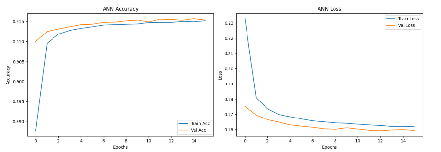
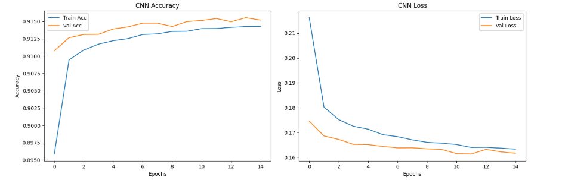
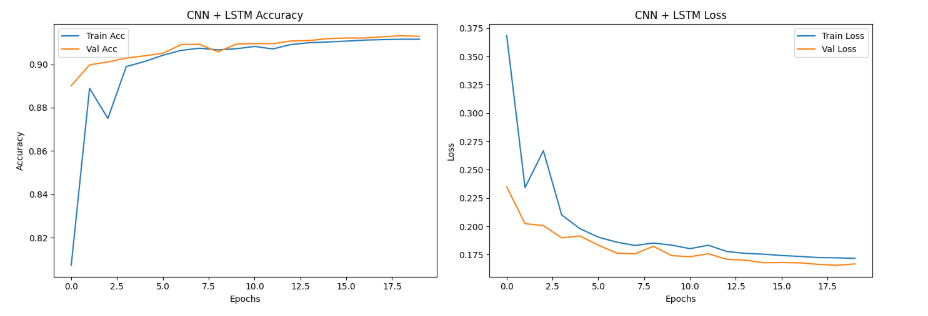
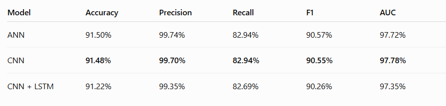
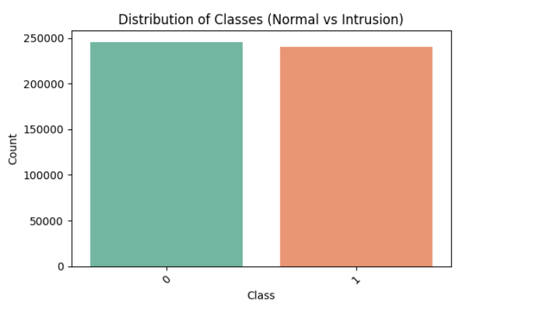
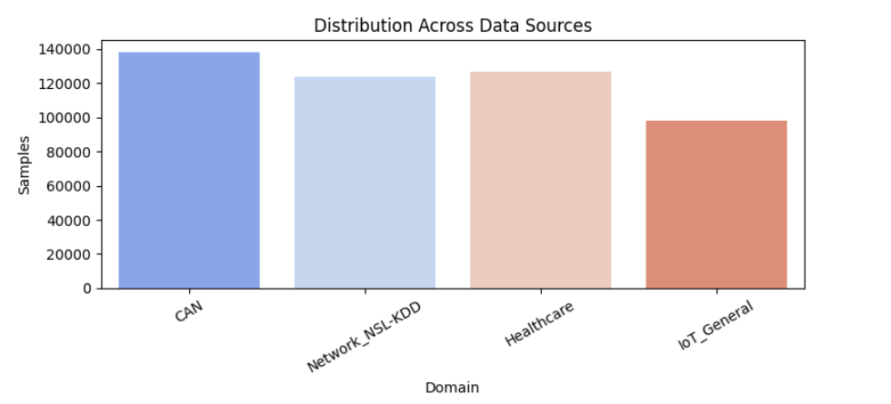
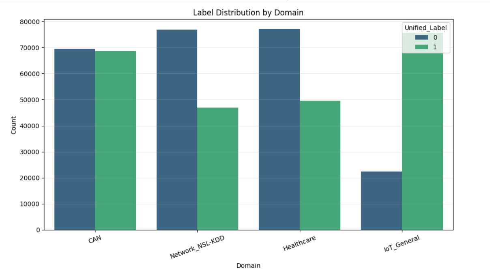
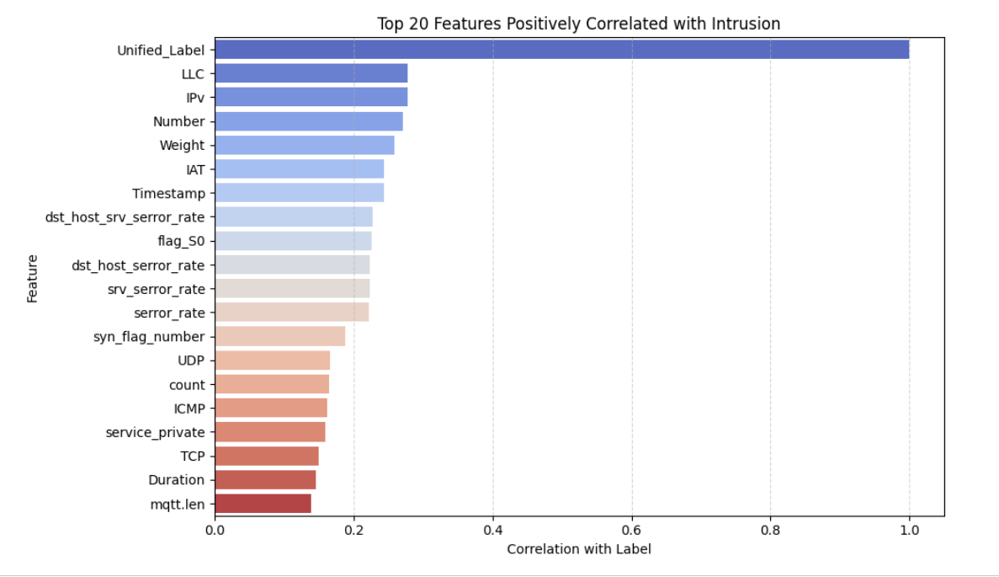
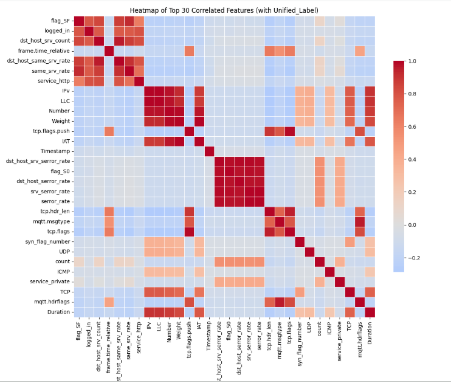

# 🛡️ Intelligent Network Intrusion Detection using Hybrid CNN–LSTM

<p align="center">
  
</p>

<p align="center">


</p>

---

# 📖 Overview

Cyber threats continue to evolve in complexity, making traditional signature-based intrusion detection systems increasingly ineffective against previously unseen attacks. Modern cybersecurity demands intelligent systems capable of learning complex attack patterns across diverse network environments.

This project presents an **Intelligent Network Intrusion Detection System (NIDS)** built using **Deep Learning**. Rather than relying on a single benchmark dataset, the project integrates multiple publicly available cybersecurity datasets spanning enterprise networks, IoT environments, healthcare systems, and connected vehicles.

A comprehensive preprocessing pipeline was developed to clean, standardize, and merge heterogeneous datasets before training deep learning models. Two architectures—a **1D Convolutional Neural Network (CNN)** and a **Hybrid CNN–LSTM**—were designed, trained, and evaluated to identify malicious network traffic.

The project demonstrates a complete deep learning workflow covering data acquisition, preprocessing, feature engineering, model development, optimization, evaluation, and deployment preparation.

---

# 🎯 Project Objectives

The primary objectives of this project are to:

- Develop an intelligent Network Intrusion Detection System (NIDS).
- Integrate multiple cybersecurity datasets into a unified training dataset.
- Design a scalable preprocessing pipeline for heterogeneous network traffic.
- Build and evaluate deep learning models for intrusion detection.
- Compare CNN and Hybrid CNN–LSTM architectures.
- Evaluate performance using multiple classification metrics.
- Prepare the trained model for deployment in real-world cybersecurity environments.

---

# 🚀 Project Highlights

✅ Multi-Dataset Integration

✅ Deep Learning-Based Intrusion Detection

✅ CNN Architecture

✅ Hybrid CNN–LSTM Model

✅ Feature Engineering

✅ TensorFlow / Keras Implementation

✅ ROC & AUC Evaluation

✅ Confusion Matrix Analysis

✅ Early Stopping & Regularization

✅ Deployment-Ready Model Serialization

---
# 🏗️ Project Architecture

This project follows a structured deep learning pipeline that transforms raw network traffic collected from multiple cybersecurity datasets into an intelligent intrusion detection system.

Each stage of the pipeline was carefully designed to ensure data quality, improve model performance, and support reproducible experimentation.

```text
                    Multiple Cybersecurity Datasets
        ┌────────────────────────────────────────────────┐
        │ NSL-KDD                                        │
        │ IoT Intrusion Dataset                          │
        │ CAN Bus Intrusion Dataset                      │
        │ Healthcare Intrusion Dataset (ICUD)            │
        └────────────────────────────────────────────────┘
                               │
                               ▼
                    Dataset Integration & Standardization
                               │
                               ▼
                     Data Cleaning & Preprocessing
              ┌─────────────────────────────────────┐
              │ • Remove duplicate records          │
              │ • Handle missing values             │
              │ • Standardize feature names         │
              │ • Encode categorical variables      │
              │ • Normalize numerical features      │
              └─────────────────────────────────────┘
                               │
                               ▼
                  Exploratory Data Analysis (EDA)
                               │
                               ▼
                    Feature Engineering & Selection
                               │
                               ▼
                     Train / Validation / Test Split
                               │
                 ┌─────────────┴──────────────┐
                 ▼                            ▼
          1D CNN Model               Hybrid CNN–LSTM
                 │                            │
                 └─────────────┬──────────────┘
                               ▼
                      Deep Learning Training
                               │
                               ▼
                    Performance Evaluation
                               │
                               ▼
                    Model Serialization (.keras)
```

---

# 🔬 Research Motivation

Network intrusion detection has traditionally relied on signature-based systems and single benchmark datasets. While these approaches are valuable, they often struggle to detect modern attacks originating from increasingly diverse environments such as Internet of Things (IoT) devices, connected vehicles, healthcare systems, and enterprise networks.

This project addresses these challenges by integrating multiple cybersecurity datasets into a unified learning framework and applying deep learning techniques capable of learning complex attack patterns.

The objective is not only to classify malicious network traffic accurately but also to build a generalized intrusion detection framework that can adapt across multiple application domains.

---

# 📂 Repository Structure

```text
01_Network_Intrusion_Detection/
│
├── README.md
├── Network_Intrusion_Detection_ML.ipynb
├── requirements.txt
├── LICENSE
├── .gitignore
│
├── images/
│   ├── cover.png
│   ├── workflow.png
│   ├── architecture.png
│   ├── cnn_architecture.png
│   ├── hybrid_cnn_lstm.png
│   ├── training_accuracy.png
│   ├── training_loss.png
│   ├── roc_curve.png
│   ├── confusion_matrix.png
│   └── model_comparison.png
│
├── dataset/
│   └── dataset_description.md
│
└── docs/
    ├── methodology.md
    └── results.md
```

---

# ⚙️ Technologies Used

This project combines modern data science, deep learning, and cybersecurity technologies.

| Category | Technologies |
|----------|--------------|
| Programming Language | Python |
| Deep Learning | TensorFlow, Keras |
| Data Analysis | Pandas, NumPy |
| Machine Learning Utilities | Scikit-learn |
| Data Visualization | Matplotlib, Seaborn |
| Notebook Environment | Jupyter Notebook |
| Model Serialization | Keras (.keras) |
| Version Control | Git & GitHub |

---

# 💡 Key Features

The project provides several capabilities that make it suitable for cybersecurity research and practical machine learning experimentation.

- Multi-domain cybersecurity dataset integration.
- Automated preprocessing pipeline.
- Feature engineering for heterogeneous network traffic.
- Deep learning using CNN and Hybrid CNN–LSTM architectures.
- Early stopping and regularization to improve generalization.
- Comprehensive evaluation using multiple performance metrics.
- Model persistence for future deployment.
- Well-documented and reproducible workflow.

---
# 📂 Datasets

A key objective of this project was to build an intrusion detection system capable of learning from multiple cybersecurity environments instead of relying on a single benchmark dataset.

To achieve this, four publicly available datasets representing different network domains were collected, standardized, and integrated into a unified training dataset. This approach exposes the deep learning models to a broader range of attack patterns, improving their ability to generalize across diverse real-world scenarios.

---

## Dataset Sources

| Dataset | Domain | Purpose |
|----------|--------|---------|
| NSL-KDD | Enterprise Network Security | Benchmark dataset for intrusion detection research. |
| IoT Intrusion Dataset | Internet of Things | Detection of attacks targeting IoT devices. |
| CAN Bus Intrusion Dataset | Automotive Cybersecurity | Detection of malicious communication within vehicle networks. |
| ICUD Healthcare Dataset | Healthcare Cybersecurity | Detection of attacks affecting healthcare systems and medical devices. |

Each dataset represents a unique cybersecurity environment with different attack behaviours, feature structures, and traffic characteristics.

---

# 🔄 Dataset Integration Strategy

One of the major engineering challenges in this project was combining heterogeneous datasets originating from different application domains.

Since each dataset contains different feature names, data formats, attack labels, and record structures, a dedicated preprocessing pipeline was developed to create a unified dataset suitable for deep learning.

The integration process involved:

- Standardizing feature names
- Aligning common network attributes
- Removing duplicate records
- Handling missing and incomplete values
- Encoding categorical variables
- Normalizing numerical features
- Harmonizing attack labels
- Creating a consistent feature space across all datasets

This unified dataset enables the CNN and Hybrid CNN–LSTM models to learn generalized intrusion patterns rather than memorizing attacks from a single benchmark dataset.

---

# 🧹 Data Preprocessing

Data preprocessing plays a critical role in ensuring high-quality model performance.

Prior to model development, each dataset underwent several preprocessing operations to eliminate inconsistencies and prepare the data for deep learning.

The preprocessing workflow included:

- Duplicate removal
- Missing value handling
- Data type validation
- Feature standardization
- Label encoding
- Feature normalization
- Dataset validation
- Final dataset merging

These steps ensured that the integrated dataset was clean, consistent, and suitable for model training.

---

# ⚙️ Feature Engineering

Feature engineering was performed to improve the predictive capability of the deep learning models.

The objective was to transform heterogeneous network traffic data into a structured feature representation capable of capturing both normal and malicious behaviour.

The feature engineering process included:

- Selection of relevant network traffic attributes
- Alignment of shared features across datasets
- Removal of redundant information
- Preparation of numerical input features
- Generation of model-ready feature vectors

This stage improves model learning while reducing unnecessary complexity and noise.

---

# 📈 Exploratory Data Analysis (EDA)

Before training the models, exploratory data analysis was conducted to better understand the characteristics of the integrated dataset.

The analysis included:

- Dataset statistics
- Class distribution analysis
- Feature distribution inspection
- Correlation analysis
- Detection of missing values
- Dataset consistency verification

These analyses provided valuable insights into the quality and structure of the data prior to model development.

---

# 🔬 Data Preparation Pipeline

```text
Multiple Public Datasets
          │
          ▼
Data Collection
          │
          ▼
Dataset Integration
          │
          ▼
Duplicate Removal
          │
          ▼
Missing Value Handling
          │
          ▼
Feature Standardization
          │
          ▼
Label Encoding
          │
          ▼
Feature Normalization
          │
          ▼
Feature Engineering
          │
          ▼
Exploratory Data Analysis
          │
          ▼
Training Dataset
```

---

# ✅ Outcomes of the Data Engineering Phase

✔ Successfully integrated multiple cybersecurity datasets into a unified framework.

✔ Developed a reusable preprocessing pipeline for heterogeneous network traffic.

✔ Standardized feature representations across different domains.

✔ Improved dataset quality through cleaning and validation.

✔ Prepared optimized inputs for deep learning model development.

---
# 🧠 Deep Learning Model Development

The core of this project focuses on the design, implementation, and evaluation of deep learning architectures capable of automatically learning complex intrusion patterns from heterogeneous network traffic.

Unlike traditional machine learning approaches that rely heavily on manual feature engineering, deep learning enables hierarchical feature extraction directly from the processed network traffic data.

Two neural network architectures were implemented and compared throughout this research.

---

# 🏗️ Model Architecture

## 1️⃣ One-Dimensional Convolutional Neural Network (CNN)

The first model developed in this project is a One-Dimensional Convolutional Neural Network (1D CNN).

CNNs are widely used for extracting local spatial patterns from structured numerical data and are particularly effective in cybersecurity applications where network traffic can be represented as sequential feature vectors.

The CNN architecture automatically learns discriminative representations of normal and malicious traffic through convolutional operations.

### CNN Components

- Input Layer
- One-Dimensional Convolution (Conv1D)
- Activation Functions
- Max Pooling Layer
- Dropout Regularization
- Fully Connected Dense Layers
- Output Classification Layer

---

## 2️⃣ Hybrid CNN–LSTM Architecture

To further improve intrusion detection performance, a Hybrid CNN–LSTM model was developed.

This architecture combines the strengths of two deep learning techniques:

### CNN

Responsible for extracting informative local feature representations from network traffic.

### LSTM

Responsible for learning long-term sequential dependencies and temporal relationships within the extracted feature representations.

The combination enables the model to learn both spatial and sequential characteristics of network behaviour, making it more suitable for detecting sophisticated cyberattacks.

---

# 🔄 Deep Learning Workflow

```text
Integrated Dataset
        │
        ▼
Data Preprocessing
        │
        ▼
Feature Engineering
        │
        ▼
Input Tensor Preparation
        │
        ▼
CNN Feature Extraction
        │
        ▼
LSTM Sequence Learning
        │
        ▼
Dense Classification Layers
        │
        ▼
Attack Prediction
```

---

# ⚙️ Model Training Strategy

Both deep learning models were trained using a structured training workflow designed to maximize predictive performance while reducing overfitting.

The training strategy included:

- Training and validation datasets
- Mini-batch learning
- Model checkpointing
- Early stopping
- Continuous monitoring of validation performance

The models were trained iteratively until convergence while preserving the best-performing model based on validation metrics.

---

# 🛡️ Regularization Techniques

To improve model generalization and reduce overfitting, several regularization techniques were incorporated into the training process.

These include:

- Dropout layers
- Early Stopping
- Validation monitoring
- Optimized training epochs

These techniques improve model stability and help maintain strong performance on previously unseen network traffic.

---

# 📊 Model Evaluation

The trained models were evaluated using multiple classification metrics to provide a comprehensive assessment of intrusion detection performance.

Evaluation metrics include:

| Metric | Purpose |
|---------|---------|
| Accuracy | Measures overall classification performance. |
| Precision | Measures the proportion of correctly identified attacks. |
| Recall | Measures the ability to detect malicious traffic. |
| F1-Score | Balances precision and recall. |
| ROC-AUC | Measures the model's discrimination capability across thresholds. |
| Confusion Matrix | Visualizes classification performance for each class. |

Using multiple evaluation metrics provides a more complete understanding of model effectiveness than relying solely on overall accuracy.

---
# 📈 Model Training & Performance Evaluation

During model development, the training process of each deep learning architecture was continuously monitored to evaluate learning behaviour, convergence, and potential overfitting.

The project compares the performance of three deep learning models:

- Artificial Neural Network (ANN)
- One-Dimensional Convolutional Neural Network (CNN)
- Hybrid CNN–LSTM Network

For each model, both training and validation metrics were recorded throughout the learning process.

The following visualizations were generated during model evaluation:

- Training Accuracy
- Validation Accuracy
- Training Loss
- Validation Loss
- Receiver Operating Characteristic (ROC) Curve
- Model Performance Comparison

These visualizations provide valuable insight into model convergence, generalization capability, and classification performance across the integrated multi-domain cybersecurity dataset.

---

# 🧠 Deep Learning Models

Three deep learning architectures were developed and evaluated to investigate their effectiveness in detecting network intrusions across the integrated multi-domain cybersecurity dataset.

---

## 1. Artificial Neural Network (ANN)

The ANN served as the baseline model for binary intrusion detection. It learns nonlinear relationships between network traffic features through fully connected layers and provides a benchmark for comparing more advanced architectures.

---

## 2. One-Dimensional Convolutional Neural Network (CNN)

The CNN automatically extracts local feature patterns from network traffic using one-dimensional convolutional layers, improving feature representation while reducing manual feature engineering.

---

## 3. Hybrid CNN–LSTM Network

The Hybrid CNN–LSTM combines convolutional feature extraction with sequential learning, enabling the model to capture both spatial and temporal characteristics of network traffic.

---

The performance of all three models was evaluated using Accuracy, Precision, Recall, F1-Score, ROC-AUC, and comparative analysis.
### Hybrid CNN–LSTM Network

<p align="center">

</p>

---

## 📈 ROC Curve Analysis

Receiver Operating Characteristic (ROC) curves were generated to evaluate the discrimination capability of each model.

The Area Under the Curve (AUC) demonstrates the ability of each model to distinguish between normal and malicious network traffic.

<p align="center">

</p>

<p align="center">

</p>

<p align="center">

</p>

---

## 🏆 Model Performance Comparison

The final models were evaluated using Accuracy, Precision, Recall, F1-Score, and ROC-AUC to compare their effectiveness in intrusion detection.

<p align="center">

</p>

# 💾 Model Persistence

After training and evaluation, the best-performing deep learning model was serialized for future inference and deployment.

Model persistence enables:

- Reuse without retraining
- Faster inference
- Integration into real-world intrusion detection systems
- Deployment within production environments

The trained model can be loaded and used to classify previously unseen network traffic.

---

# 🎯 Key Achievements

✅ Designed and implemented a 1D CNN architecture for intrusion detection.

✅ Developed a Hybrid CNN–LSTM model for enhanced feature learning.

✅ Applied regularization techniques to improve model generalization.

✅ Evaluated deep learning models using comprehensive performance metrics.

✅ Prepared the trained model for future deployment in intelligent cybersecurity applications.

---
# 📊 Results & Discussion

The proposed multi-domain intrusion detection framework successfully integrated cybersecurity datasets from enterprise networks, healthcare systems, Internet of Things (IoT) environments, and connected vehicle networks into a unified machine learning pipeline.

Comprehensive exploratory data analysis confirmed balanced class distributions, domain diversity, and meaningful feature relationships prior to model development.

Three deep learning architectures were trained and evaluated:

- Artificial Neural Network (ANN)
- One-Dimensional Convolutional Neural Network (CNN)
- Hybrid CNN–LSTM Network

Performance was assessed using multiple evaluation metrics, including Accuracy, Precision, Recall, F1-Score, and ROC-AUC.

Overall, the models achieved consistently high classification performance, with ROC-AUC values exceeding **97%**, demonstrating strong capability in distinguishing normal network traffic from intrusion attempts.

The comparative analysis shows that all three architectures produced competitive results, while the ensemble strategy further explored opportunities to improve prediction robustness and model reliability across multiple cybersecurity domains.

---

# 📊 Exploratory Data Analysis & Dataset Insights

Before training the deep learning models, an extensive exploratory data analysis (EDA) was conducted to understand the characteristics of the integrated cybersecurity dataset. This process verified data quality, examined class balance, analyzed feature relationships, and confirmed the suitability of the merged dataset for intrusion detection.

---

## 1. Class Distribution

The merged dataset contains a balanced distribution of **normal** and **intrusion** traffic samples. Maintaining class balance is essential for reducing prediction bias and enabling the models to learn both classes effectively.

<p align="center">

</p>

---

## 2. Distribution Across Data Sources

The integrated dataset combines four cybersecurity domains, providing diverse network traffic from different operational environments.

- **CAN Bus** – Connected vehicle networks
- **NSL-KDD** – Enterprise network traffic
- **Healthcare IoT** – Medical device communication
- **General IoT** – Internet of Things devices

This diversity improves the robustness and generalization capability of the intrusion detection models.

<p align="center">

</p>

---

## 3. Label Distribution by Domain

This visualization illustrates the distribution of **normal** and **intrusion** samples within each cybersecurity domain.

The analysis confirms that attack samples are represented across all integrated datasets, ensuring the models learn intrusion patterns from multiple environments instead of relying on a single benchmark.

<p align="center">

</p>

---

## 4. Feature Importance Analysis

Feature correlation analysis was performed to identify the network attributes most strongly associated with malicious traffic.

Understanding feature importance provides valuable insight into the behavioural patterns that distinguish intrusion attempts from legitimate network activity.

<p align="center">

</p>

---

## 5. Correlation Analysis

A correlation heatmap was generated to visualize relationships among the most significant network features after preprocessing and feature engineering.

This analysis highlights feature dependencies and helps identify redundant or highly correlated variables that may influence model performance.

<p align="center">

</p>

---

# 🧠 Deep Learning Model Training

Three deep learning architectures were developed and trained to evaluate their effectiveness in detecting network intrusions.

- Artificial Neural Network (ANN)
- One-Dimensional Convolutional Neural Network (CNN)
- Hybrid CNN–LSTM Network

Training and validation accuracy, together with loss curves, were monitored throughout the learning process to assess convergence, stability, and generalization performance.

---

# 🚀 Installation

Clone the repository

```bash
git clone https://github.com/pyscar/Machine-Learning-Portfolio.git
```

Navigate to the project

```bash
cd Machine-Learning-Portfolio/01_Network_Intrusion_Detection
```

Install dependencies

```bash
pip install -r requirements.txt
```

Launch Jupyter Notebook

```bash
jupyter notebook
```

Open

```text
Network_Intrusion_Detection_ML.ipynb
```

---

# ▶️ How to Run

1. Install all project dependencies.

2. Download the required datasets.

3. Update dataset paths inside the notebook if necessary.

4. Execute the notebook sequentially from top to bottom.

5. Train the CNN model.

6. Train the Hybrid CNN–LSTM model.

7. Evaluate the models using the provided metrics and visualizations.

8. Save the best-performing model for future inference.

---

# 💼 Practical Applications

The developed intrusion detection framework can be adapted for a wide range of cybersecurity applications, including:

- Enterprise Network Security
- Cloud Infrastructure Monitoring
- Internet of Things (IoT) Security
- Smart Healthcare Systems
- Connected Vehicle (CAN Bus) Security
- Security Operations Centers (SOC)
- Academic Cybersecurity Research

---

# 🔮 Future Improvements

Potential future enhancements include:

- Incorporating Transformer-based architectures for sequential modelling.
- Evaluating Graph Neural Networks (GNNs) for network traffic analysis.
- Integrating Explainable AI (XAI) techniques such as SHAP or LIME.
- Deploying the model as a real-time intrusion detection API.
- Benchmarking additional public cybersecurity datasets.
- Containerizing the solution using Docker.
- Developing a web dashboard for live threat monitoring.

---

# 📚 References

This project is based on publicly available cybersecurity datasets and established deep learning frameworks.

Key technologies include:

- TensorFlow
- Keras
- Scikit-learn
- Pandas
- NumPy
- Matplotlib
- Seaborn

---

# 👨‍💻 Author

## Oscar Kiamba

**Computer Science Graduate | Artificial Intelligence & Machine Learning**

Passionate about Artificial Intelligence, Machine Learning, Data Science, Deep Learning, Cybersecurity, and Intelligent Automation.

### Connect with me

🌐 Portfolio: https://oscarkiamba.vercel.app/

💻 GitHub: https://github.com/pyscar

💼 LinkedIn: https://www.linkedin.com/in/oscar-kiamba/

🆔 ORCID: https://orcid.org/0009-0003-7127-4186

---

## ⭐ Support

If you found this project useful, consider giving it a ⭐ on GitHub.

It helps others discover the project and supports continued development.

---

## 📄 License

This project is released under the **MIT License**.

See the `LICENSE` file for more information.