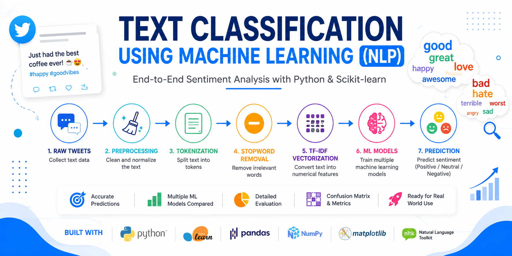
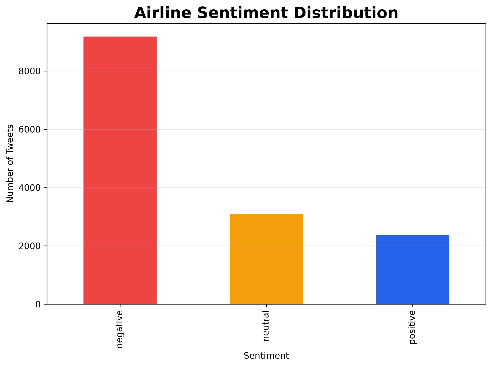
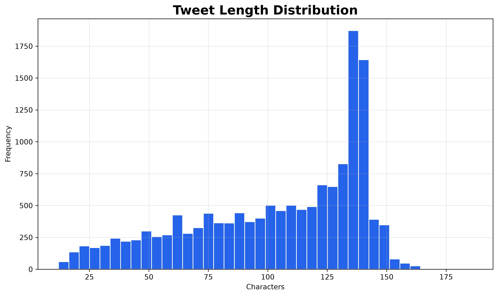
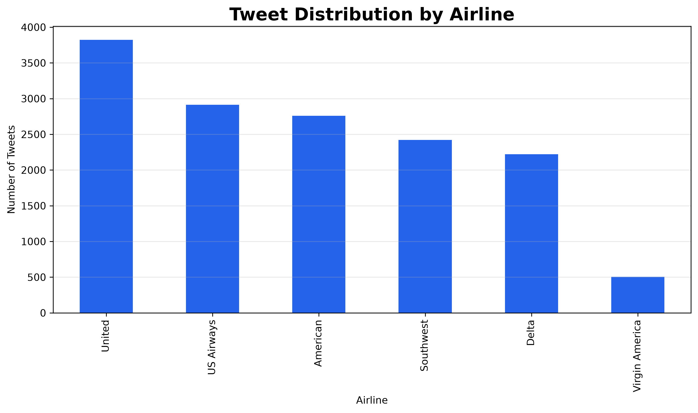
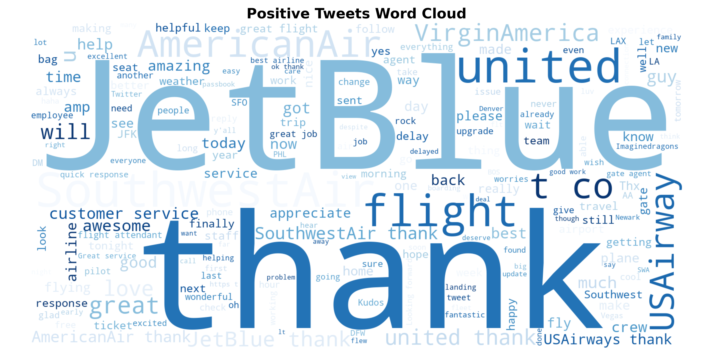
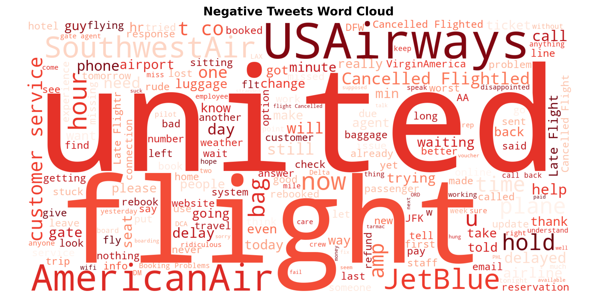
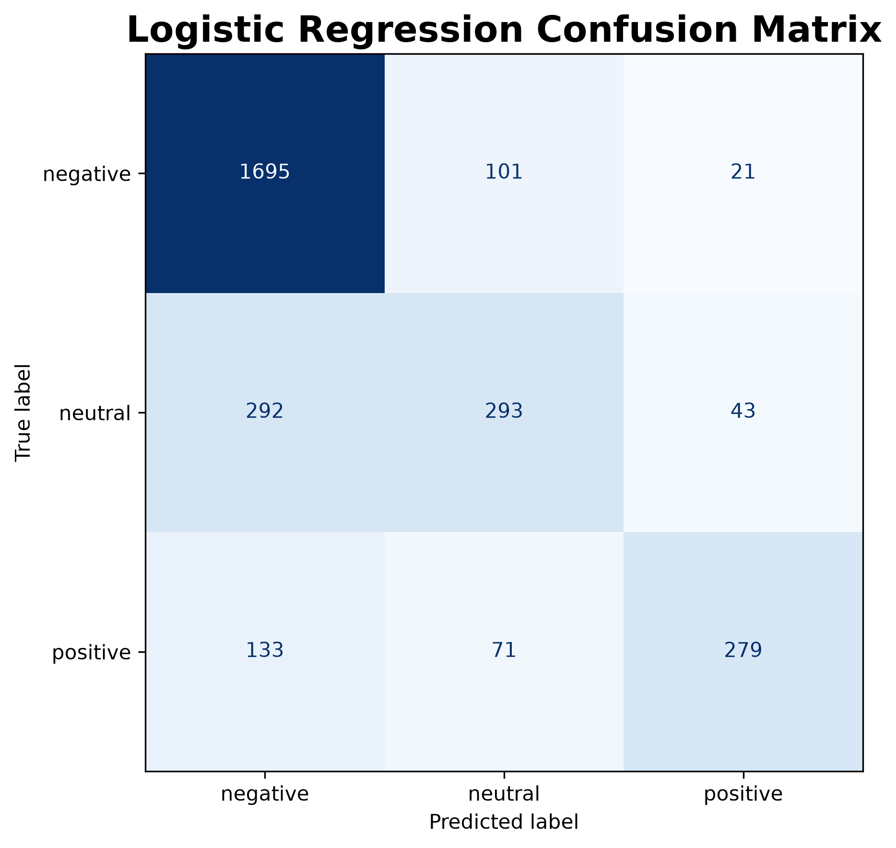
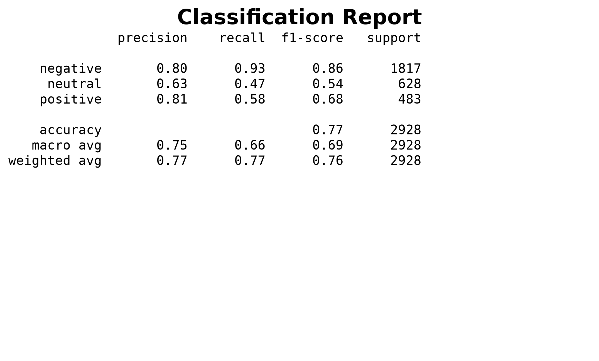
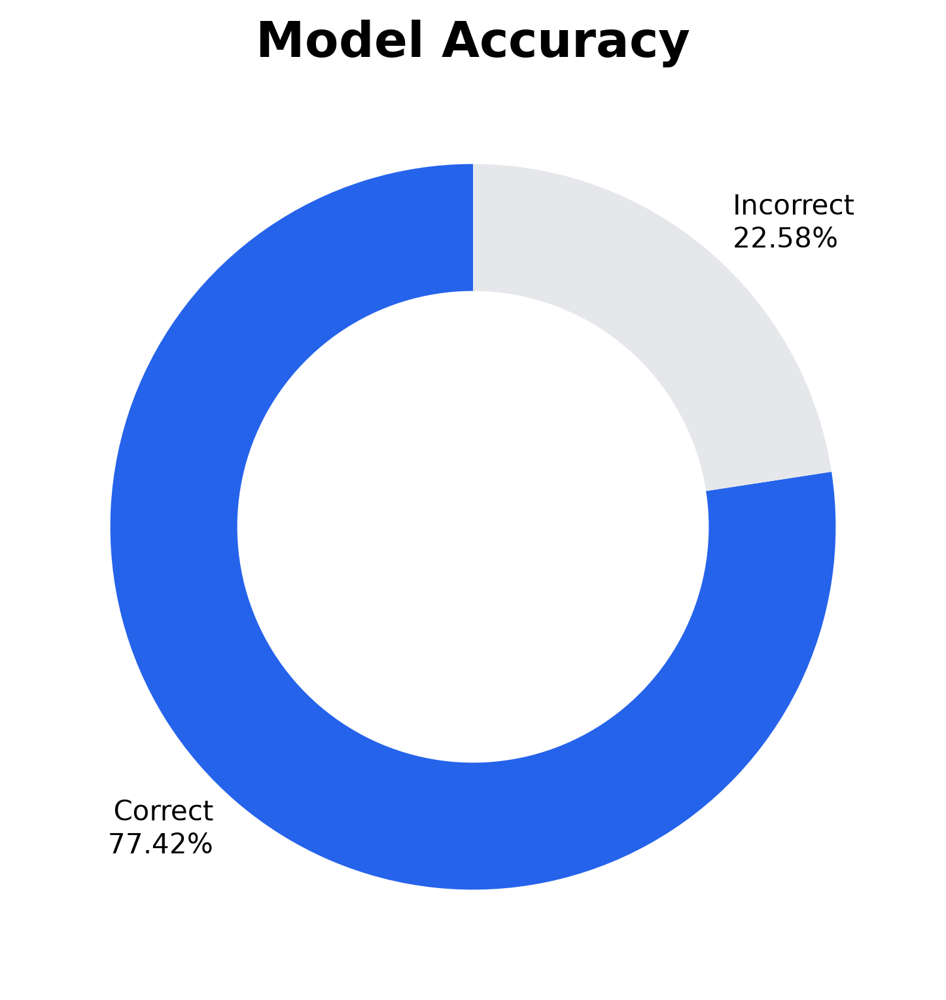
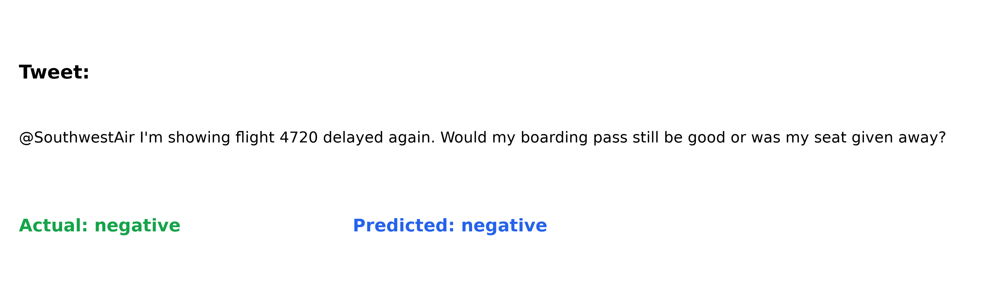

<p align="center">
    
</p>

# 📝 Text Classification using Machine Learning (NLP)


> An end-to-end Natural Language Processing (NLP) project that classifies airline tweets into **Positive**, **Neutral**, and **Negative** sentiments using **TF-IDF Vectorization** and **Logistic Regression**.

---

# 📌 Project Overview

Sentiment analysis is one of the most widely used Natural Language Processing (NLP) applications, helping organizations understand customer opinions from textual data.

In this project, tweets directed at major U.S. airlines are analyzed and classified according to customer sentiment. The project demonstrates a complete NLP pipeline, including text preprocessing, feature engineering, machine learning model training, evaluation, and prediction.

---

# 🎯 Objectives

- Perform Exploratory Data Analysis (EDA)
- Analyze airline tweet sentiments
- Clean and preprocess text data
- Convert text into TF-IDF features
- Train a Logistic Regression classifier
- Evaluate model performance
- Build a reusable sentiment prediction pipeline

---

# 📂 Dataset

This project uses the **Twitter US Airline Sentiment** dataset.

The dataset contains customer tweets directed at major U.S. airlines and includes sentiment labels.

### Dataset Features

- Tweet ID
- Airline
- Tweet Text
- Airline Sentiment
- Sentiment Confidence
- Negative Reason
- Tweet Timestamp
- User Location

Dataset location:

```
dataset/airline-tweets.csv
```

---

# 🛠 Technologies Used

- Python
- Jupyter Notebook
- Pandas
- NumPy
- Matplotlib
- Scikit-learn
- NLTK
- WordCloud
- Regular Expressions (re)

---

# 📚 NLP Pipeline

```
Raw Tweets
      │
      ▼
Text Cleaning
      │
      ▼
Tokenization
      │
      ▼
Stopword Removal
      │
      ▼
TF-IDF Vectorization
      │
      ▼
Logistic Regression
      │
      ▼
Prediction
      │
      ▼
Evaluation
```

---

# 📊 Exploratory Data Analysis

### Sentiment Distribution

<p align="center">

</p>

---

### Tweet Length Distribution

<p align="center">

</p>

---

### Airline Distribution

<p align="center">

</p>

---

# ☁️ Word Clouds

### Positive Tweets

<p align="center">

</p>

---

### Negative Tweets

<p align="center">

</p>

---

# 🤖 Machine Learning Model

The project uses:

- TF-IDF Vectorization
- Logistic Regression Classifier

The trained model predicts whether an airline tweet expresses:

- 😊 Positive sentiment
- 😐 Neutral sentiment
- 😞 Negative sentiment

---

# 📈 Model Evaluation

The classifier is evaluated using:

- Accuracy
- Precision
- Recall
- F1-Score
- Confusion Matrix
- Classification Report

### Confusion Matrix

<p align="center">

</p>

---

### Classification Report

<p align="center">

</p>

---

### Model Accuracy

<p align="center">

</p>

---

# 🔮 Sample Prediction

<p align="center">

</p>

---

# 🏆 Key Results

- Successfully classified airline tweets into three sentiment classes.
- Applied TF-IDF vectorization for numerical feature extraction.
- Trained a Logistic Regression classifier.
- Evaluated the model using multiple classification metrics.
- Built a complete NLP sentiment analysis pipeline.

---

# 📁 Project Structure

```
02_Text_Classification_NLP/
│
├── dataset/
│   └── airline-tweets.csv
│
├── images/
│   ├── cover.png
│   ├── airline_distribution.png
│   ├── class_distribution.png
│   ├── tweet_length_distribution.png
│   ├── sentiment_pie_chart.png
│   ├── sentiment_confidence.png
│   ├── top_words.png
│   ├── wordcloud_positive.png
│   ├── wordcloud_negative.png
│   ├── confusion_matrix.png
│   ├── classification_report.png
│   ├── prediction_example.png
│   └── model_accuracy.png
│
├── Text_Classification.ipynb
├── README.md
├── requirements.txt
├── LICENSE
└── report.md
```

---

# 🚀 Installation

Clone the repository

```bash
git clone https://github.com/pyscar/02_Text_Classification_NLP.git
```

Navigate into the project

```bash
cd 02_Text_Classification_NLP
```

Install dependencies

```bash
pip install -r requirements.txt
```

Launch Jupyter Notebook

```bash
jupyter notebook
```

Open

```
Text_Classification.ipynb
```

---

# 📌 Applications

This project demonstrates techniques used in:

- Sentiment Analysis
- Customer Feedback Analytics
- Social Media Monitoring
- Brand Reputation Analysis
- Opinion Mining
- Natural Language Processing

---

# 📈 Future Improvements

- Compare multiple machine learning algorithms.
- Hyperparameter optimization.
- Word2Vec and GloVe embeddings.
- Fine-tune transformer models such as BERT.
- Deploy the model using Streamlit.
- Build a REST API using FastAPI.

---

# 👨‍💻 Author

**Oscar Kiamba**

Computer Science | Machine Learning | Data Science | Natural Language Processing

---

# 📄 License

This project is licensed under the MIT License.

---

⭐ If you found this project useful, consider giving the repository a star.