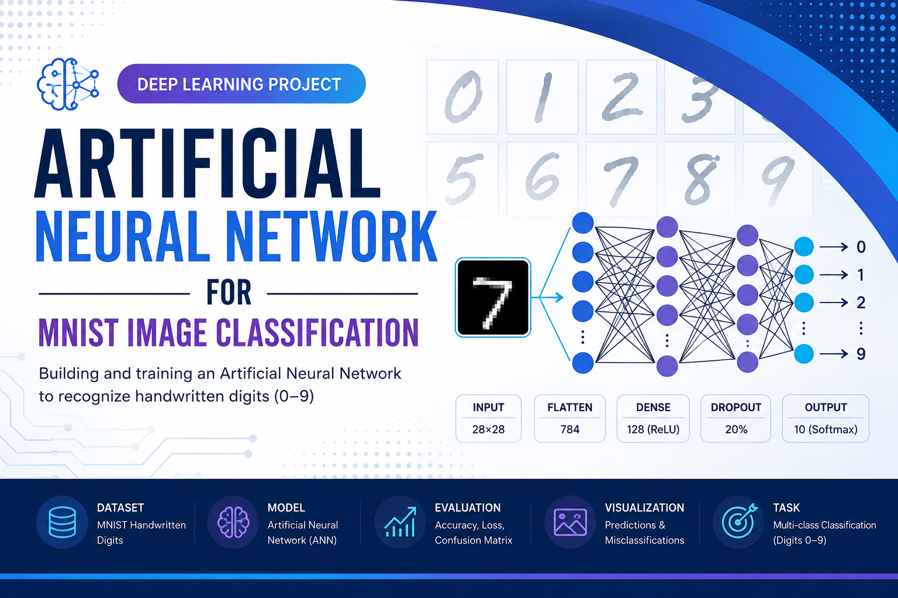
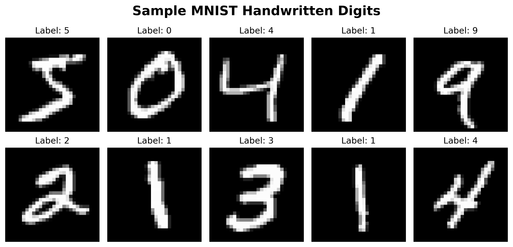
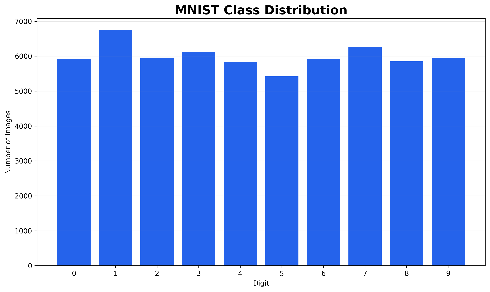
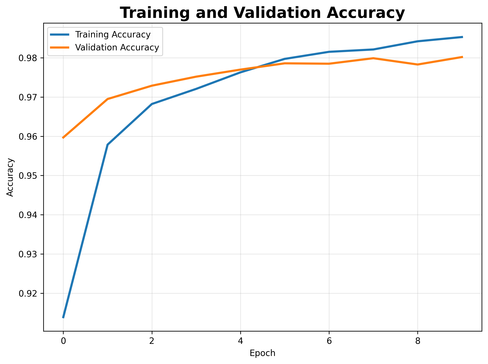
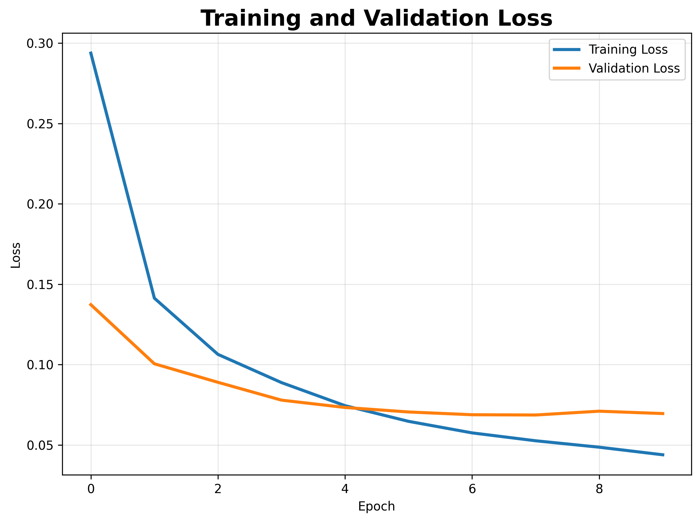
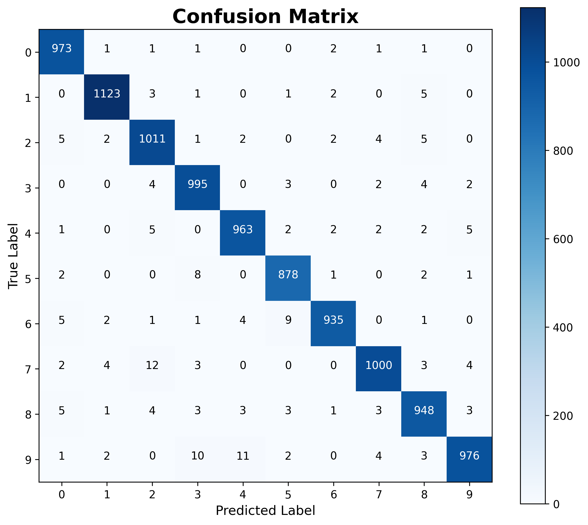
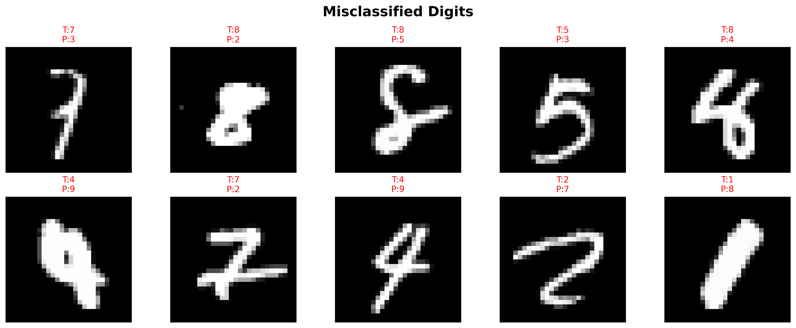
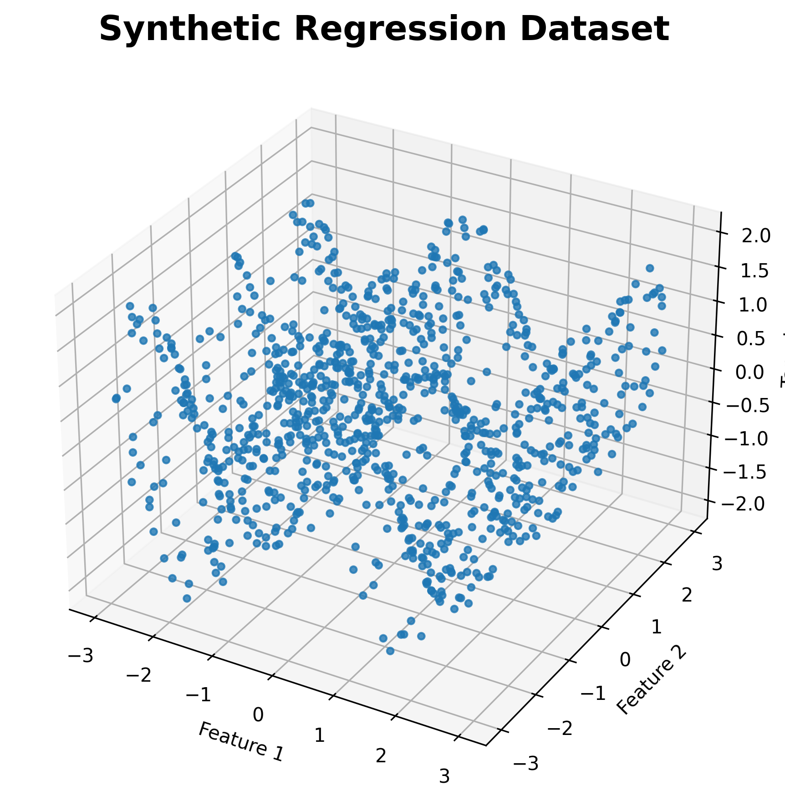
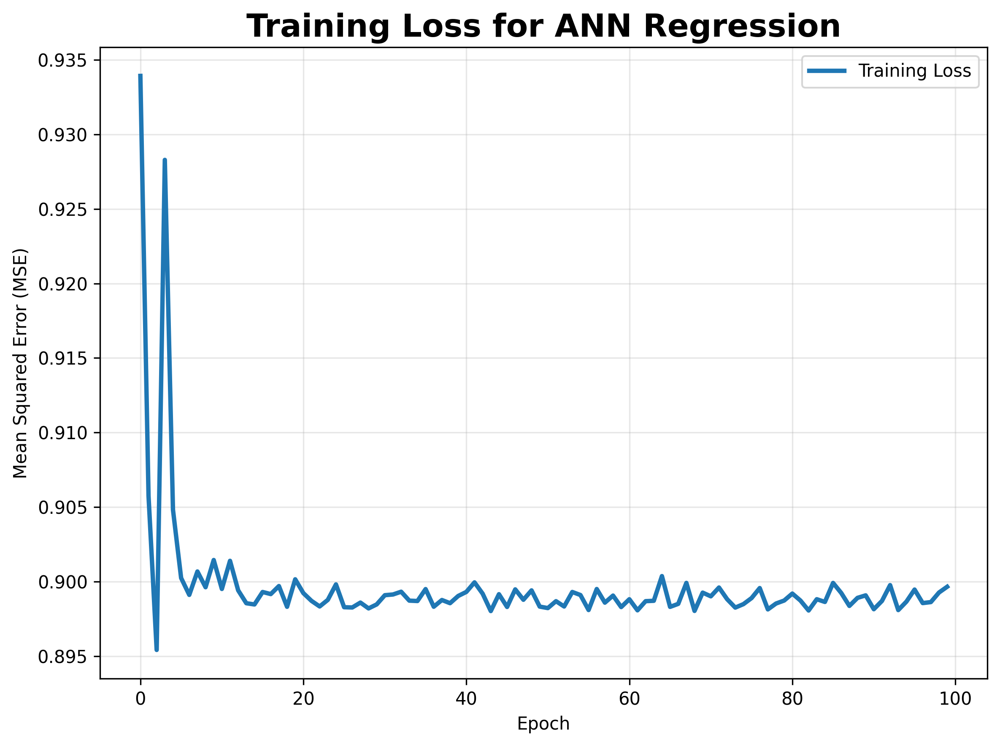
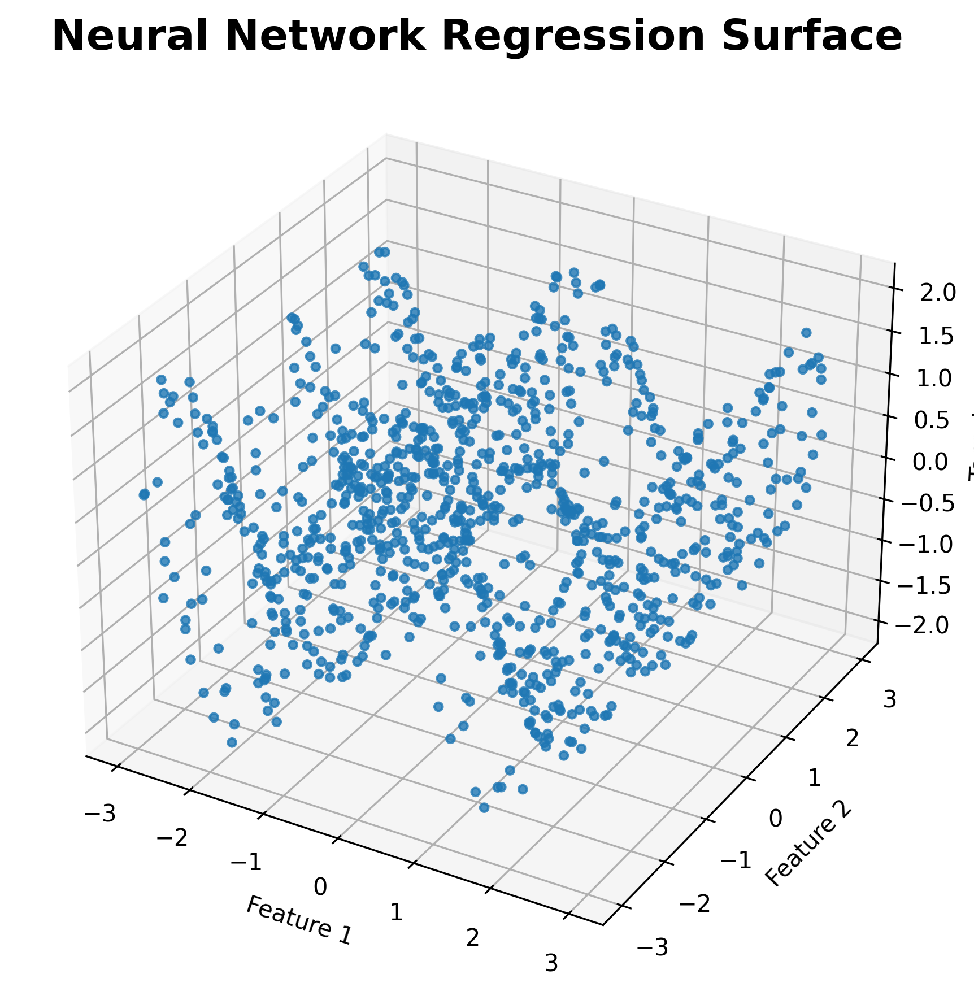

# 🧠 Artificial Neural Network for MNIST Image Classification


> A Deep Learning project that implements an **Artificial Neural Network (ANN)** using **TensorFlow/Keras** to recognize handwritten digits from the MNIST dataset. The project demonstrates the complete deep learning workflow, including data preprocessing, neural network design, training, evaluation, and prediction.

---

# 📌 Project Overview

Handwritten digit recognition is one of the fundamental problems in computer vision and deep learning. The MNIST dataset has become the benchmark dataset for learning image classification using Artificial Neural Networks.

This project develops an ANN capable of classifying grayscale handwritten digit images (0–9). The notebook covers the entire deep learning pipeline, from loading and preprocessing the dataset to training, evaluating, and visualizing model performance.

---

# 🎯 Objectives

- Load and explore the MNIST dataset
- Normalize image pixel values
- Build an Artificial Neural Network using TensorFlow/Keras
- Train the neural network
- Monitor training and validation performance
- Evaluate classification accuracy
- Visualize predictions and misclassified examples
- Demonstrate ANN regression on synthetic data

---

# 📂 Dataset

This project uses the **MNIST Handwritten Digits Dataset** provided directly by TensorFlow/Keras.

Dataset characteristics:

- **60,000** training images
- **10,000** testing images
- Image size: **28 × 28 pixels**
- **10 output classes (digits 0–9)**

Dataset loading:

```python
mnist = tf.keras.datasets.mnist
(x_train, y_train), (x_test, y_test) = mnist.load_data()
```

No manual dataset download is required.

---

# 🛠 Technologies Used

- Python
- TensorFlow
- Keras
- NumPy
- Matplotlib
- Scikit-learn
- Jupyter Notebook

---

# 🧠 Neural Network Architecture

The ANN implemented in this project consists of:

- Flatten Layer (28×28 → 784)
- Dense Layer (128 neurons, ReLU activation)
- Dropout Layer (20%)
- Output Layer (10 neurons, Softmax activation)

<p align="center">

</p>

---

# 🔄 Deep Learning Workflow

```
MNIST Images
      │
      ▼
Normalization
      │
      ▼
Flatten Layer
      │
      ▼
Dense Layer (128)
      │
      ▼
ReLU Activation
      │
      ▼
Dropout (20%)
      │
      ▼
Dense Layer (10)
      │
      ▼
Softmax
      │
      ▼
Digit Prediction
```

---

# 📊 Dataset Exploration

### Sample Handwritten Digits

<p align="center">

</p>

---

### Class Distribution

<p align="center">

</p>

---

# 📈 Model Training

The model is trained using:

- Adam Optimizer
- Sparse Categorical Crossentropy Loss
- 10 Epochs
- Validation Dataset

### Training Accuracy

<p align="center">

</p>

---

### Training Loss

<p align="center">

</p>

---

# 📉 Model Evaluation

Performance is evaluated using:

- Accuracy
- Loss
- Confusion Matrix
- Prediction Visualization
- Misclassified Examples

### Confusion Matrix

<p align="center">

</p>

---

### Prediction Examples

<p align="center">

</p>

---

### Misclassified Digits

<p align="center">

</p>

---

# 📐 ANN Regression Example

The notebook also demonstrates the use of Artificial Neural Networks for regression using a synthetic nonlinear dataset.

### Synthetic Regression Dataset

<p align="center">

</p>

---

### ANN Regression Training Loss

<p align="center">

</p>

---

### Regression Prediction Surface

<p align="center">

</p>

---

# 🏆 Key Results

- Successfully trained an ANN to classify handwritten digits.
- Achieved high classification accuracy on the MNIST test dataset.
- Demonstrated the effectiveness of fully connected neural networks.
- Visualized training dynamics through accuracy and loss curves.
- Evaluated predictions using confusion matrices and misclassification analysis.
- Extended the notebook with a neural network regression example.

---

# 📁 Project Structure

```
03_ANN_MNIST/
│
├── docs/
│   └── report.md
│
├── images/
│   ├── cover.png
│   ├── sample_digits.png
│   ├── class_distribution.png
│   ├── neural_network_architecture.png
│   ├── training_accuracy.png
│   ├── training_loss.png
│   ├── confusion_matrix.png
│   ├── prediction_examples.png
│   ├── misclassified_digits.png
│   ├── regression_dataset.png
│   ├── ann_regression_training_loss.png
│   └── regression_prediction_surface.png
│
├── ANN_MNIST.ipynb
├── README.md
├── requirements.txt
├── LICENSE
└── docs/
    └── report.md
```

---

# 🚀 Installation

Clone the repository:

```bash
git clone https://github.com/pyscar/03_ANN_MNIST.git
```

Navigate to the project:

```bash
cd 03_ANN_MNIST
```

Install the dependencies:

```bash
pip install -r requirements.txt
```

Launch Jupyter Notebook:

```bash
jupyter notebook
```

Open:

```
ANN_MNIST.ipynb
```

---

# 📌 Applications

The techniques demonstrated in this project are applicable to:

- Handwritten Character Recognition
- Optical Character Recognition (OCR)
- Image Classification
- Computer Vision
- Medical Image Analysis
- Document Digitization
- Deep Learning Research

---

# 📈 Future Improvements

- Implement Convolutional Neural Networks (CNNs)
- Compare ANN and CNN performance
- Apply data augmentation techniques
- Perform hyperparameter tuning
- Deploy the model using Streamlit
- Export the trained model for inference

---

# 👨‍💻 Author

**Oscar Kiamba**

Computer Science | Machine Learning | Deep Learning | Artificial Intelligence

---

# 📄 License

This project is licensed under the MIT License.

---

⭐ If you found this project useful, consider giving the repository a star!