# Camouflage Object Detection in Low-Light using Deep Learning

<p align="center">
  
</p>

<p align="center">


</p>

---

# Project Overview

This project presents a complete deep learning framework for detecting **camouflaged animals under extreme low-light UAV surveillance environments**.

Unlike traditional image classification projects, this work investigates how severe environmental degradation affects learned visual representations and proposes an adaptive enhancement framework capable of recovering discriminative features before classification.

The proposed pipeline integrates:

- Environmental luminance standardization
- UAV low-light simulation
- Adaptive image enhancement
- Transfer learning with ResNet-50
- Grad-CAM attention visualization
- Automated object localization
- Feature drift analysis
- Saliency Energy Ratio (SER)
- Statistical evaluation
- Model performance analysis

The project demonstrates that adaptive enhancement substantially improves feature localization and classification performance under highly degraded imaging conditions.

---

# Objectives

- Simulate realistic UAV night surveillance conditions
- Standardize environmental luminance
- Recover hidden image information
- Train a deep transfer learning model
- Generate Grad-CAM attention maps
- Perform automated object localization
- Analyze feature drift using dimensionality reduction
- Measure localization quality using Saliency Energy Ratio (SER)
- Evaluate model performance using standard classification metrics

---

# Dataset

The study uses two datasets.

- Clear Animal Images
- Camouflaged Animal Images

The dataset contains **15 animal categories**.

- Bear
- Bird
- Bulky Insect
- Canine
- Feline
- Flat Fish
- Flat Insect
- Frog
- Horse Type
- Octopus
- Owl
- Reptile
- Small Fish
- Small Mammal
- Stick Insect

---

# Methodology

The complete research framework follows the pipeline below.

```text
Dataset
      │
      ▼
Environmental Standardization
      │
      ▼
Extreme Low-Light UAV Simulation
      │
      ▼
Adaptive Image Enhancement
      │
      ▼
Transfer Learning (ResNet-50)
      │
      ▼
Grad-CAM Attention Maps
      │
      ▼
Automated Object Localization
      │
      ▼
Feature Drift Analysis (PCA + MDS)
      │
      ▼
Saliency Energy Ratio (SER)
      │
      ▼
Performance Evaluation
```

---

# Deep Learning Model

## Backbone

- ResNet-50
- ImageNet Pre-trained

## Framework

- PyTorch
- TorchVision

## Transfer Learning

- Replace final classification layer
- Fine-tune Layer4
- Adam Optimizer

## Hyperparameters

| Parameter | Value |
|-----------|-------|
| Optimizer | Adam |
| Learning Rate | 1e-4 |
| Loss Function | CrossEntropyLoss |
| Backbone | ResNet-50 |

---

# Final Model Performance

After fine-tuning the ResNet-50 backbone, the proposed framework achieved the following validation performance.

| Metric | Score |
|---------|---------|
| **Validation Accuracy** | **74.17%** |
| **Precision** | **75.37%** |
| **Recall** | **74.17%** |
| **F1 Score** | **73.08%** |

These results demonstrate that adaptive enhancement combined with transfer learning significantly improves camouflage recognition under simulated UAV night-time environments.

---

# Experimental Analysis

The notebook includes comprehensive experimental evaluation.

- Environmental Standardization
- Low-Light Simulation
- Adaptive Enhancement
- Grad-CAM Visualization
- Automated Object Localization
- Feature Drift Analysis
- PCA Projection
- MDS Visualization
- Confidence Recovery
- Saliency Energy Ratio (SER)
- SER Recovery Analysis
- Statistical Regression
- Ablation Study
- Classification Report
- Confusion Matrix
- Training Curves
- Validation Curves

---

# Generated Visualizations

---

## Environmental Standardization

<p align="center">

</p>

---

## Daylight vs Simulated UAV Environment

<p align="center">
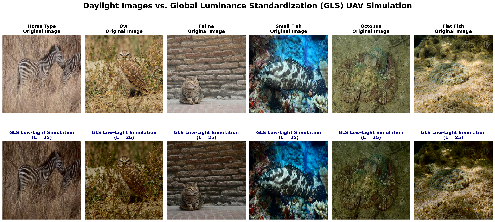
</p>

---

## Baseline vs Proposed Attention Maps

<p align="center">
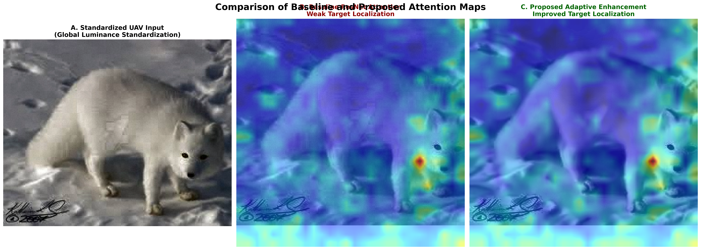
</p>

---

## Automated Object Detection

<p align="center">
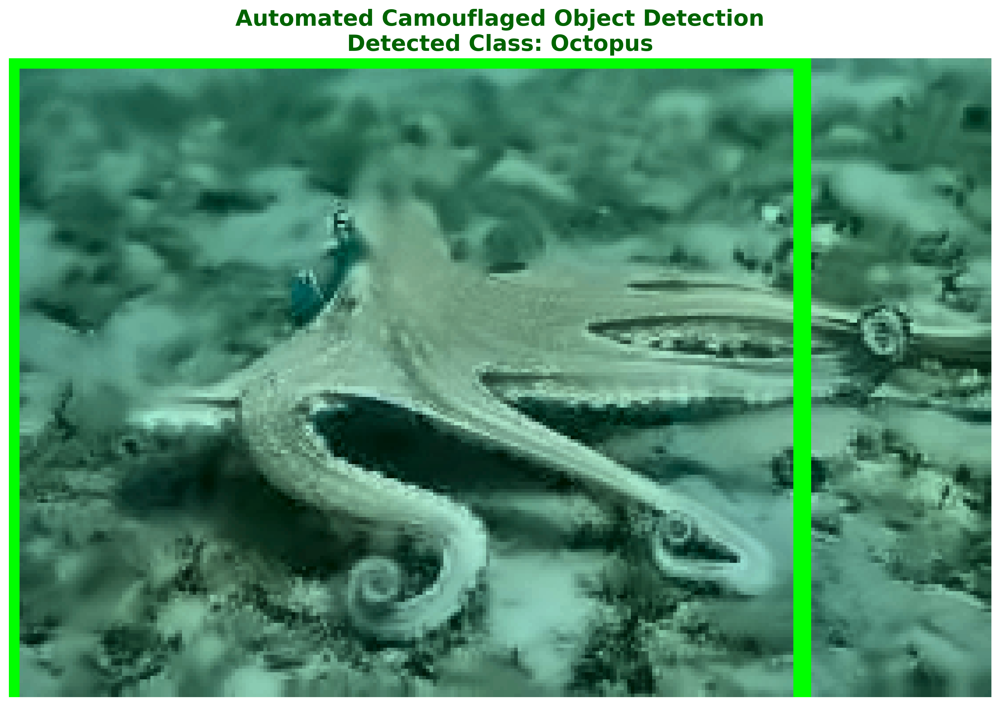
</p>

---

## PCA Feature Drift

<p align="center">
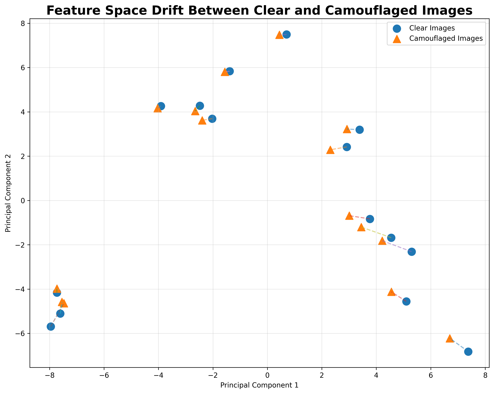
</p>

---

## MDS Feature Displacement

<p align="center">
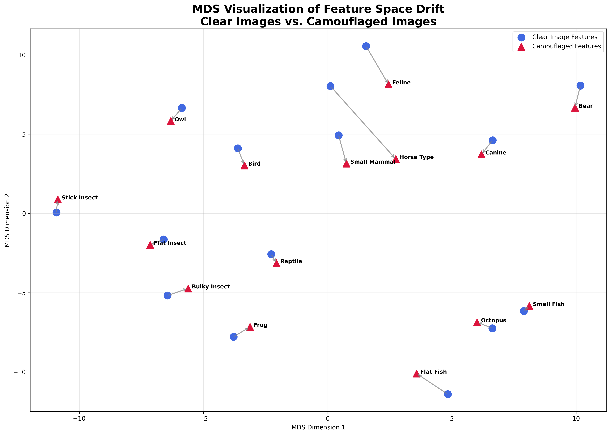
</p>

---

## Feature Drift Statistics

<p align="center">
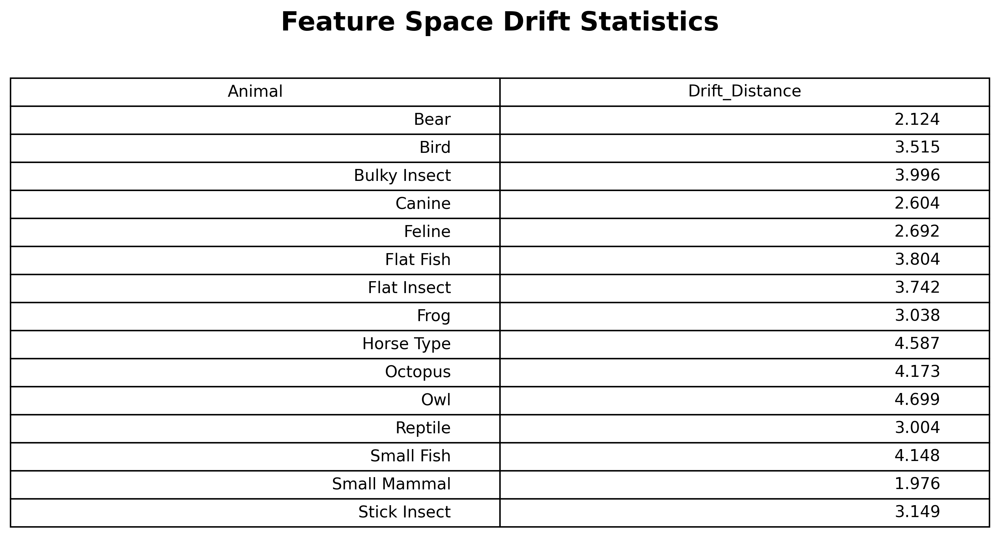
</p>

---

## Confidence Recovery

<p align="center">
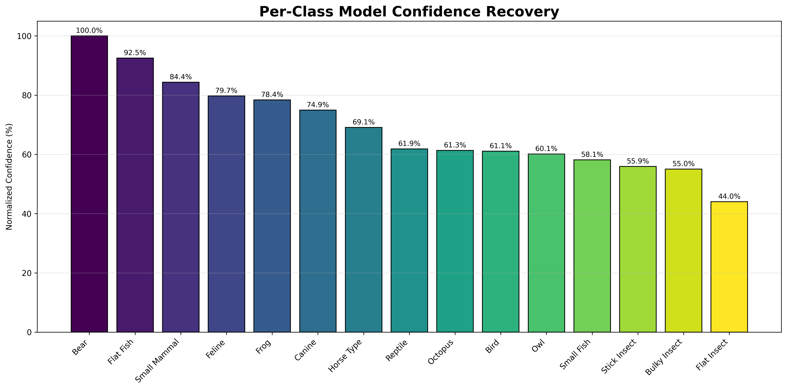
</p>

---

## Feature Drift Regression

<p align="center">
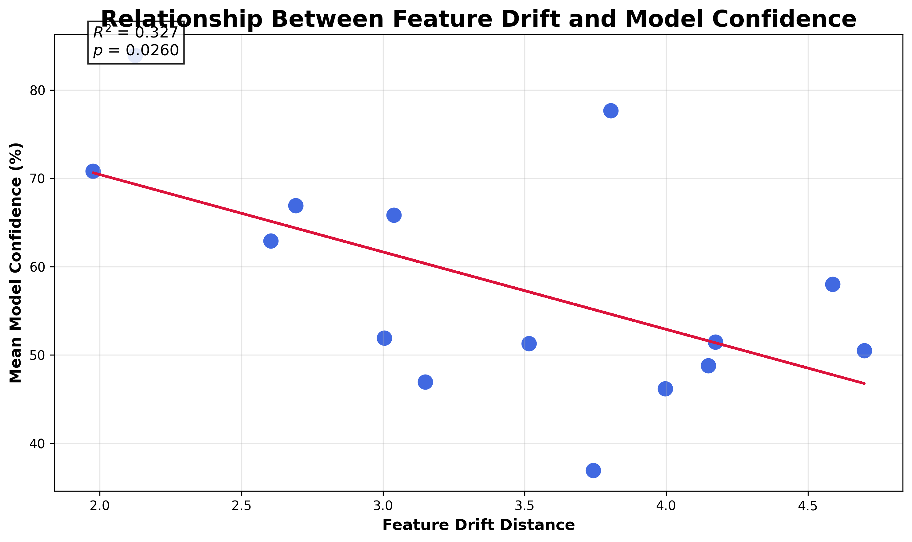
</p>

---

## Saliency Energy Ratio (SER)

<p align="center">
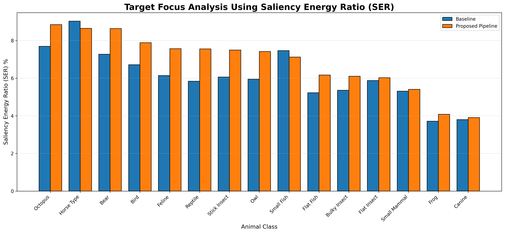
</p>

---

## Spatial Localization Gain

<p align="center">
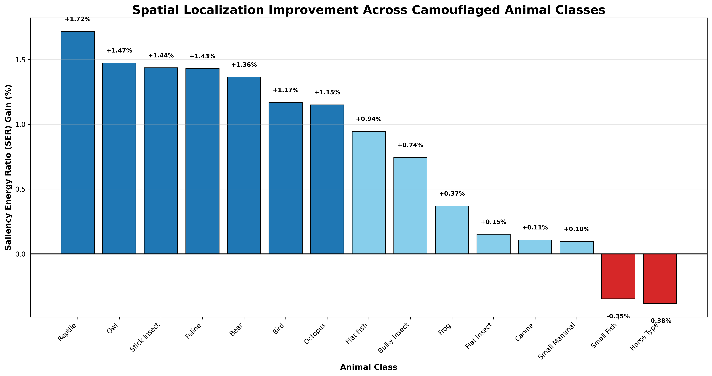
</p>

---

## SER Recovery Gain

<p align="center">
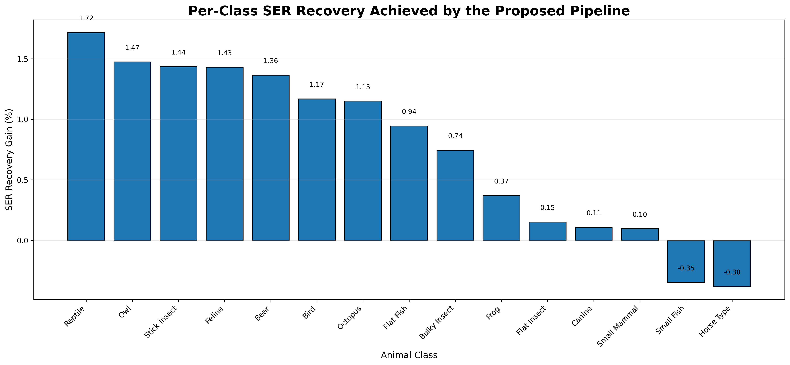
</p>

---

## Ablation Study

<p align="center">
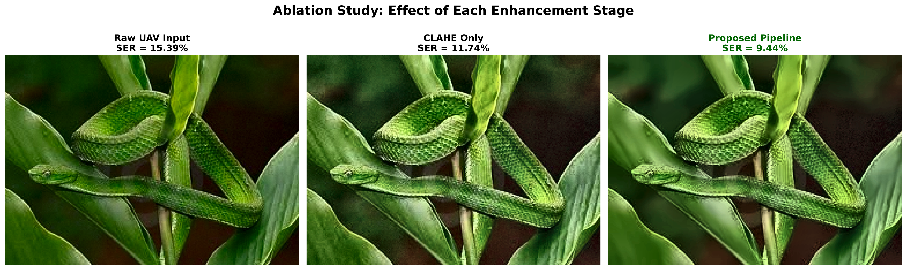
</p>

---

## Classification Report

<p align="center">
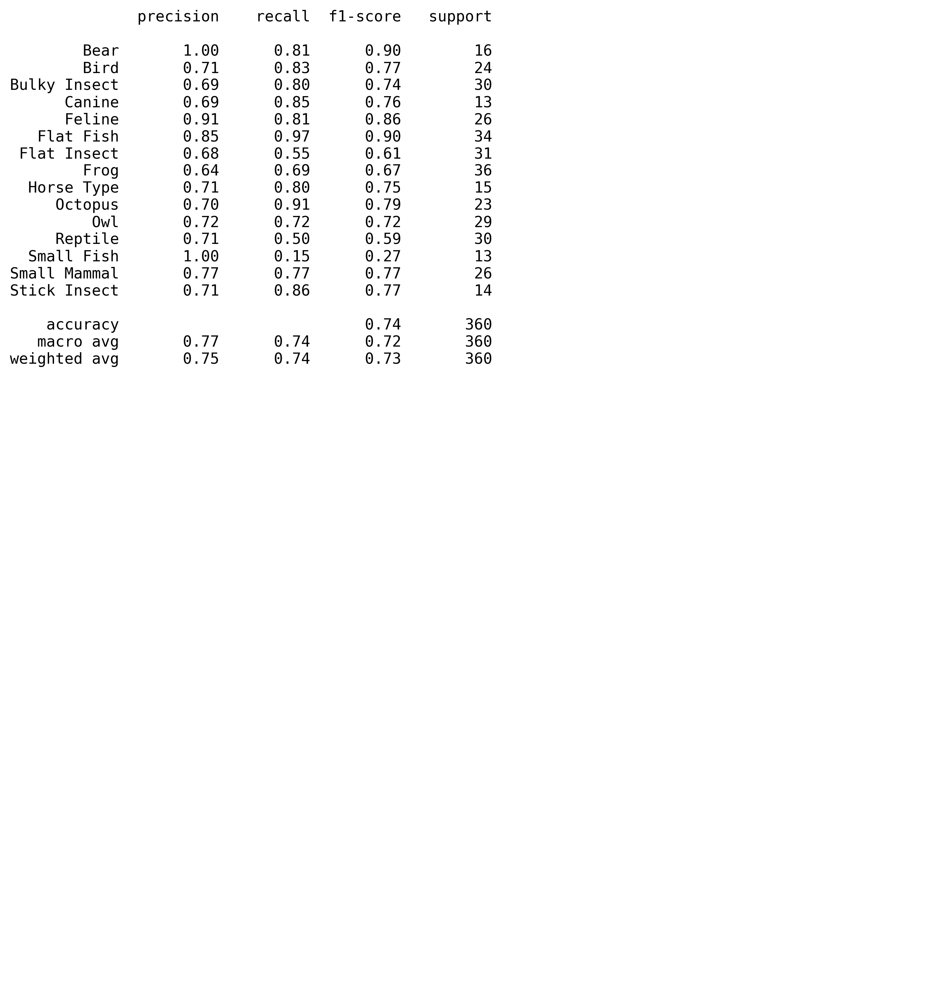
</p>

---

## Confusion Matrix

<p align="center">
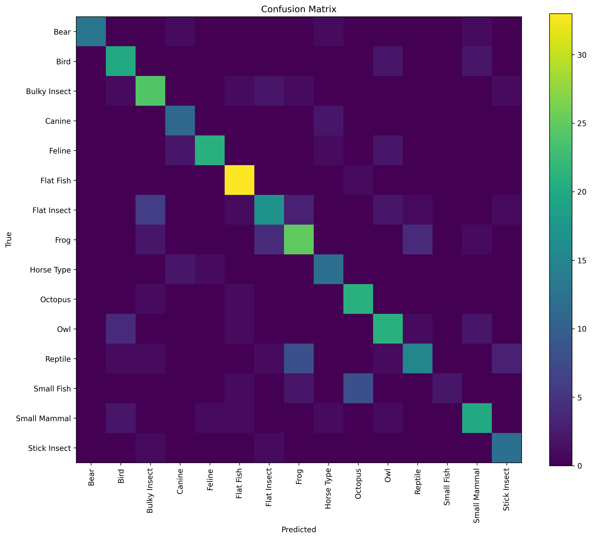
</p>

---

## Accuracy Curve

<p align="center">
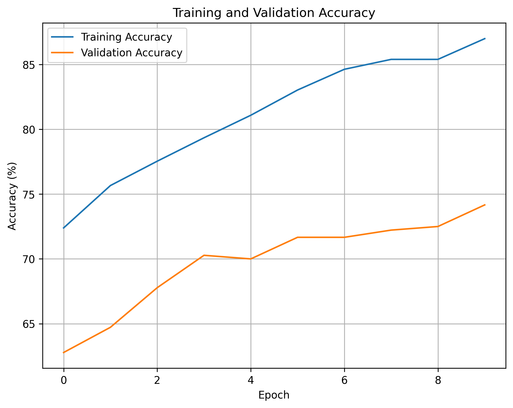
</p>

---

## Loss Curve

<p align="center">
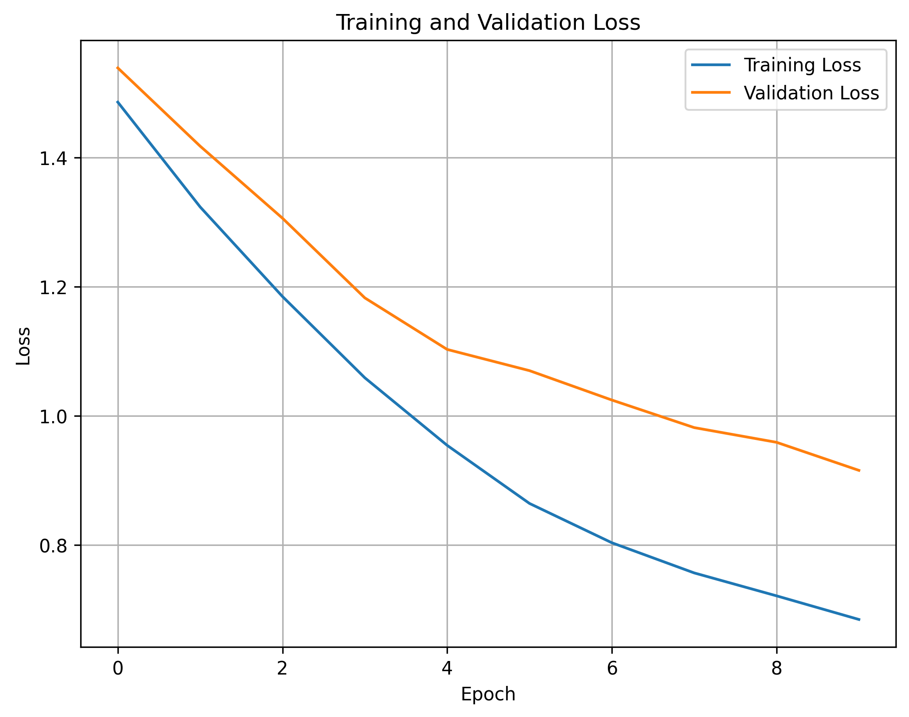
</p>

---

# Technologies Used

- Python
- PyTorch
- TorchVision
- OpenCV
- NumPy
- Pandas
- Matplotlib
- Scikit-Learn
- SciPy
- Pillow

---

# Installation

Clone the complete Machine Learning Portfolio.

```bash
git clone https://github.com/pyscar/Machine-Learning-Portfolio.git
```

Navigate to this project.

```bash
cd Machine-Learning-Portfolio/04_Camouflage_Object_Detection
```

Install dependencies.

```bash
pip install -r requirements.txt
```

---

# Running the Project

Launch Jupyter Notebook.

```bash
jupyter notebook
```

Open

```text
Camouflage_Object_Detection.ipynb
```

Run all notebook cells sequentially to reproduce the complete experimental pipeline.

---

# Repository Structure

```text
04_Camouflage_Object_Detection/

├── Camouflage_Object_Detection.ipynb
├── README.md
├── LICENSE
├── requirements.txt
│
├── dataset/
│   └── README.md
│
├── docs/
│   └── report.md
│
├── images/
│   ├── cover.png
│   ├── global_luminance_standardization.png
│   ├── daylight_vs_uav_simulation.png
│   ├── proposed_vs_baseline_attention.png
│   ├── object_detection_result.png
│   ├── pca_feature_drift.png
│   ├── mds_feature_displacement.png
│   ├── feature_space_drift_statistics.png
│   ├── confidence_recovery_bar_chart.png
│   ├── r2_generalization_curve.png
│   ├── ser_comparison.png
│   ├── spatial_localization_gain.png
│   ├── ser_recovery_gain.png
│   ├── ablation_study.png
│   ├── classification_report.png
│   ├── confusion_matrix.png
│   ├── accuracy_curve.png
│   └── loss_curve.png
│
└── models/
```

---

# Future Improvements

- Vision Transformers (ViT)
- Swin Transformer
- ConvNeXt
- YOLOv11 Detection
- Semantic Segmentation
- Thermal-RGB Fusion
- Real-Time UAV Video Processing
- Edge AI Deployment

---

# License

This project is licensed under the **MIT License**.

---

# Acknowledgements

- PyTorch
- TorchVision
- OpenCV
- NumPy
- SciPy
- Scikit-Learn
- Scientific Python Community

---

# Author

**Oscar Kiamba**

Artificial Intelligence • Machine Learning • Computer Vision

GitHub: https://github.com/pyscar

---

⭐ If you found this project useful, consider starring the repository.