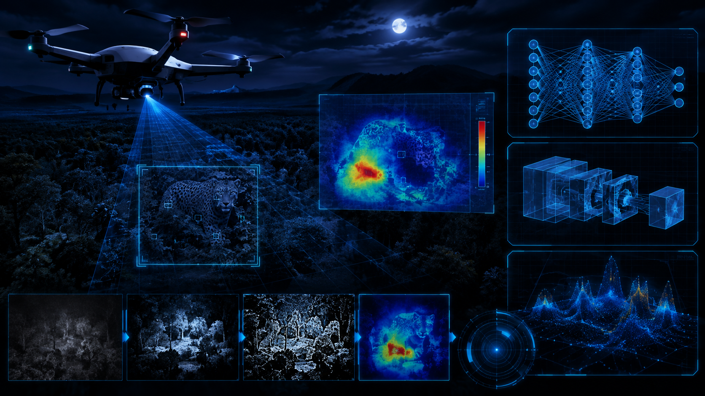

# Camouflage Object Detection in Low-Light using Deep Learning


---

# Project Overview

This project presents a deep learning framework for detecting camouflaged animals under **extreme low-light UAV surveillance environments**. The proposed system combines environmental luminance standardization, adaptive image enhancement, transfer learning with ResNet-50, attention-based localization, and feature drift analysis to improve object recognition in visually challenging conditions.

Beyond image classification, the project investigates how environmental degradation affects learned feature representations and demonstrates how adaptive enhancement can recover discriminative visual information.

The complete pipeline includes low-light simulation, feature extraction, Grad-CAM visualization, automated object localization, Saliency Energy Ratio (SER) analysis, dimensionality reduction, and comprehensive model evaluation.

---

# Objectives

- Simulate realistic UAV night-time surveillance conditions
- Standardize environmental luminance
- Enhance degraded low-light imagery
- Train a ResNet-50 classifier using transfer learning
- Generate attention heatmaps using Grad-CAM
- Perform automated object localization
- Analyze feature drift using MDS
- Quantify localization quality using Saliency Energy Ratio (SER)
- Evaluate classification performance using multiple metrics

---

# Dataset

Two image datasets were used throughout the study.

- Clear Animal Images
- Camouflaged Animal Images

The dataset contains **15 animal categories**:

- Bear
- Bird
- Bulky Insect
- Canine
- Feline
- Flat Fish
- Flat Insect
- Frog
- Horse Type
- Octopus
- Owl
- Reptile
- Small Fish
- Small Mammal
- Stick Insect

---

# Methodology

The proposed framework follows the pipeline below.

```
Dataset
      │
      ▼
Environmental Standardization
      │
      ▼
Extreme Low-Light UAV Simulation
      │
      ▼
Adaptive Image Enhancement
      │
      ▼
Transfer Learning (ResNet-50)
      │
      ▼
Attention Heatmaps (Grad-CAM)
      │
      ▼
Automated Object Localization
      │
      ▼
Feature Drift Analysis (MDS)
      │
      ▼
Saliency Energy Ratio (SER)
      │
      ▼
Performance Evaluation
```

---

# Deep Learning Model

## Backbone Network

- ResNet-50 (Pre-trained on ImageNet)

## Framework

- PyTorch
- TorchVision

## Loss Function

- CrossEntropyLoss

## Optimizer

- Adam

## Learning Rate

- 1e-4

## Fine-Tuning Strategy

- Replace final fully connected layer
- Fine-tune Layer4
- Transfer Learning

---

# Model Performance

After fine-tuning the ResNet-50 model, the proposed framework achieved the following performance on the validation dataset.

| Metric | Score |
|---------|-------:|
| **Validation Accuracy** | **74.17%** |
| **Precision** | **75.37%** |
| **Recall** | **74.17%** |
| **F1 Score** | **73.08%** |

These results demonstrate that adaptive enhancement combined with transfer learning substantially improves camouflage recognition under simulated low-light conditions.

---

# Experimental Analysis

The notebook includes comprehensive experimental evaluation:

- Training Loss
- Validation Loss
- Training Accuracy
- Validation Accuracy
- Classification Report
- Confusion Matrix
- Precision
- Recall
- F1 Score
- Grad-CAM Attention Maps
- Automated Object Localization
- Feature Drift Analysis (MDS)
- Saliency Energy Ratio (SER)
- SER Recovery Analysis
- Ablation Study

---

# Generated Visualizations

| Figure | Description |
|----------|-------------|
| cover.png | Project cover illustration |
| luminance_standardization.png | Environmental standardization |
| sample_comparison.png | Daylight vs Low-Light comparison |
| enhancement_pipeline.png | Adaptive enhancement pipeline |
| attention_maps.png | Baseline vs Proposed Grad-CAM |
| object_detection.png | Automated localization |
| mds_feature_drift.png | Feature displacement visualization |
| feature_drift_table.png | Drift statistics |
| drift_regression.png | Feature Drift vs Confidence Regression |
| focus_recovery_bar.png | SER recovery analysis |
| ser_summary.png | Spatial localization gain |
| confusion_matrix.png | Classification performance |
| training_loss.png | Training loss |
| validation_loss.png | Validation loss |
| training_accuracy.png | Training accuracy |
| validation_accuracy.png | Validation accuracy |

---

# Technologies Used

- Python
- PyTorch
- TorchVision
- OpenCV
- NumPy
- Pandas
- Matplotlib
- Scikit-Learn
- SciPy
- PIL

---

# Installation

Clone the repository.

```bash
git clone https://github.com//04_Camouflage_Object_Detection.git
```

Navigate into the project.

```bash
cd 04_Camouflage_Object_Detection
```

Install the required packages.

```bash
pip install -r requirements.txt
```

---

# Running the Project

Launch Jupyter Notebook.

```bash
jupyter notebook
```

Open:

```
Camouflage_Object_Detection.ipynb
```

Run all notebook cells sequentially to reproduce the complete experimental pipeline.

---

# Repository Structure

```
04_Camouflage_Object_Detection/

├── Camouflage_Object_Detection.ipynb
├── README.md
├── requirements.txt
├── LICENSE
│
├── dataset/
│   └── README.md
│
├── docs/
│   └── report.md
│
├── images/
│   ├── cover.png
│   ├── luminance_standardization.png
│   ├── sample_comparison.png
│   ├── enhancement_pipeline.png
│   ├── attention_maps.png
│   ├── object_detection.png
│   ├── mds_feature_drift.png
│   ├── feature_drift_table.png
│   ├── drift_regression.png
│   ├── focus_recovery_bar.png
│   ├── ser_summary.png
│   ├── confusion_matrix.png
│   ├── training_loss.png
│   ├── validation_loss.png
│   ├── training_accuracy.png
│   └── validation_accuracy.png
│
└── models/
```

---

# Future Improvements

- Vision Transformers (ViT)
- Swin Transformer
- ConvNeXt
- YOLOv11 Object Detection
- Semantic Segmentation
- Thermal–RGB Image Fusion
- Real-time UAV Video Processing
- Edge AI Deployment on Embedded Devices

---

# License

This project is licensed under the **MIT License**.

---

# Acknowledgements

- PyTorch
- TorchVision
- OpenCV
- Scikit-Learn
- NumPy
- Scientific Python Community

---

# Author

**Oscar Kiamba**

Artificial Intelligence • Machine Learning • Computer Vision