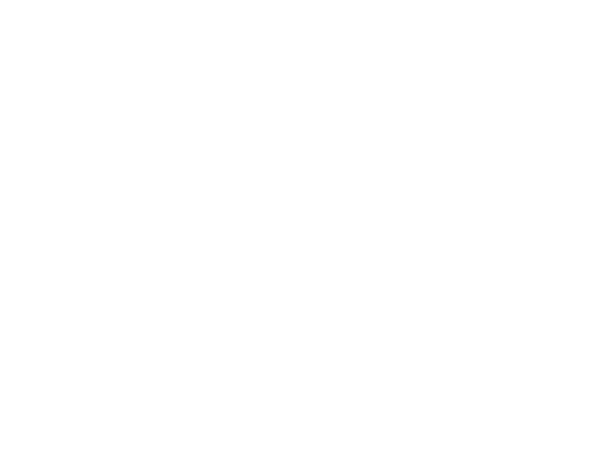
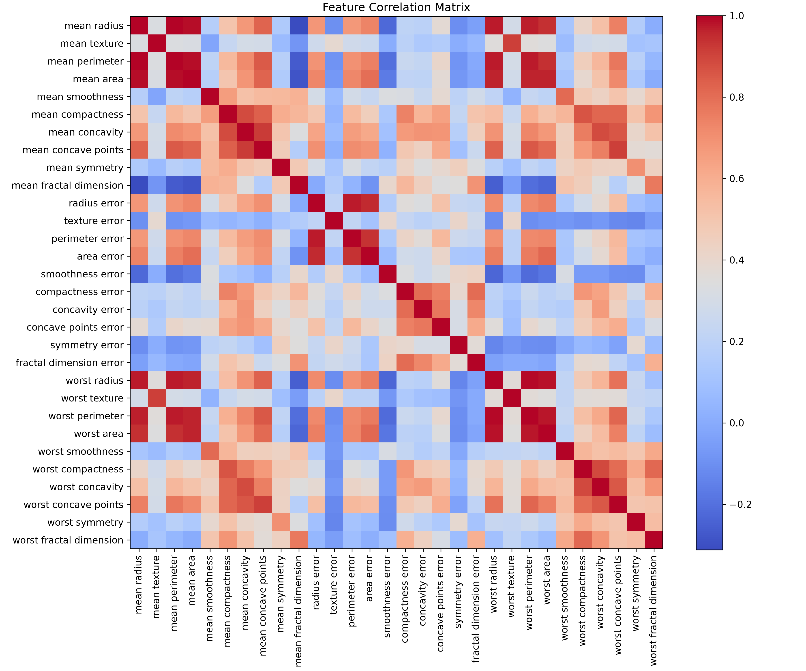
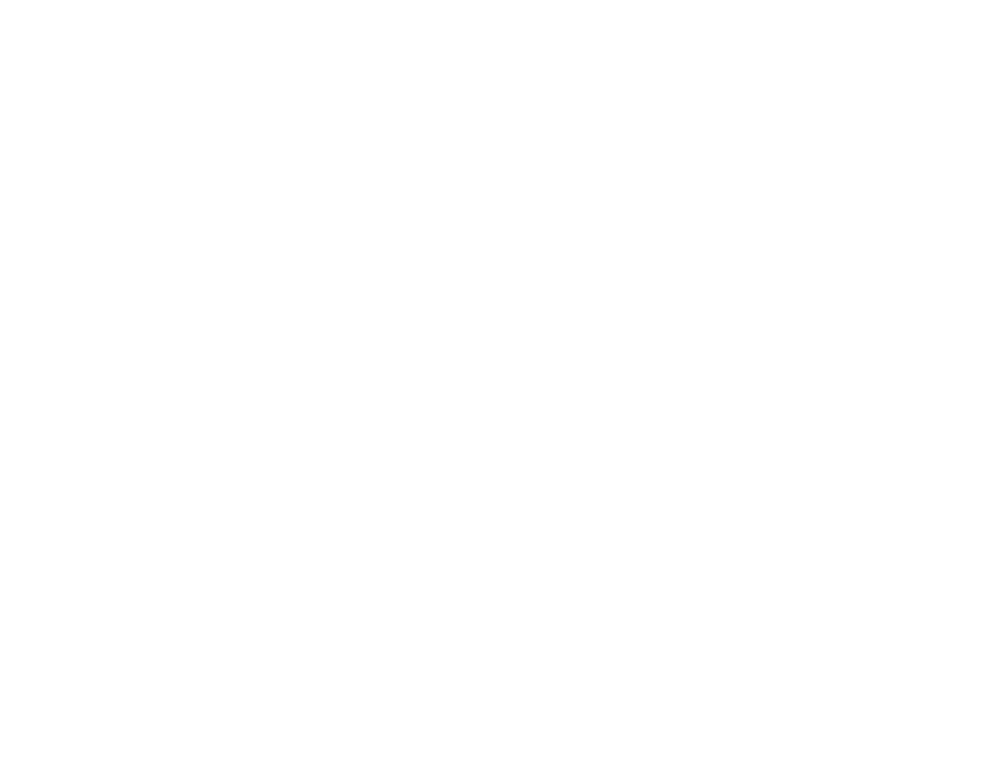
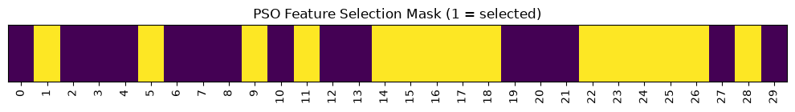
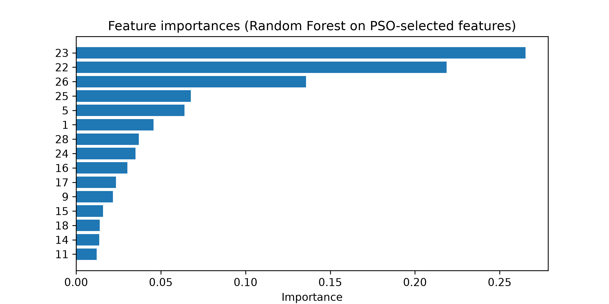
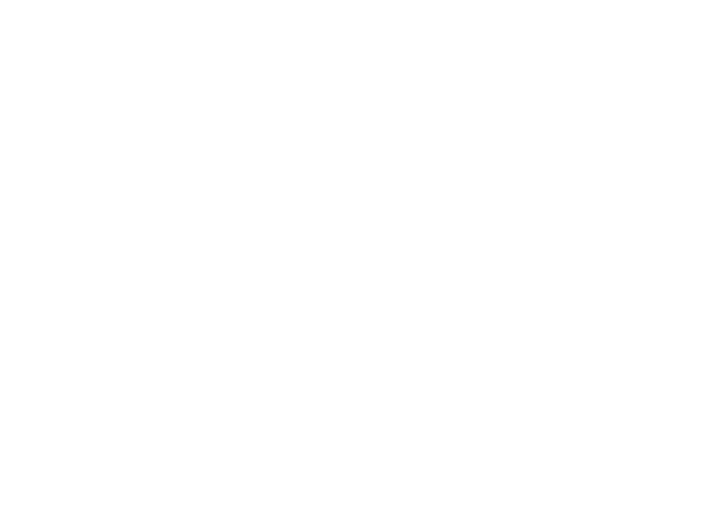
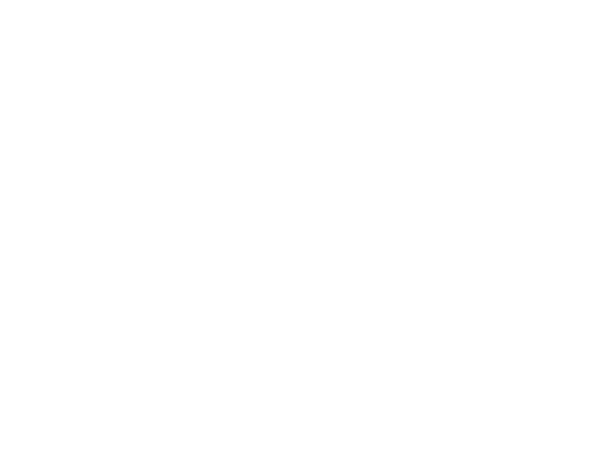
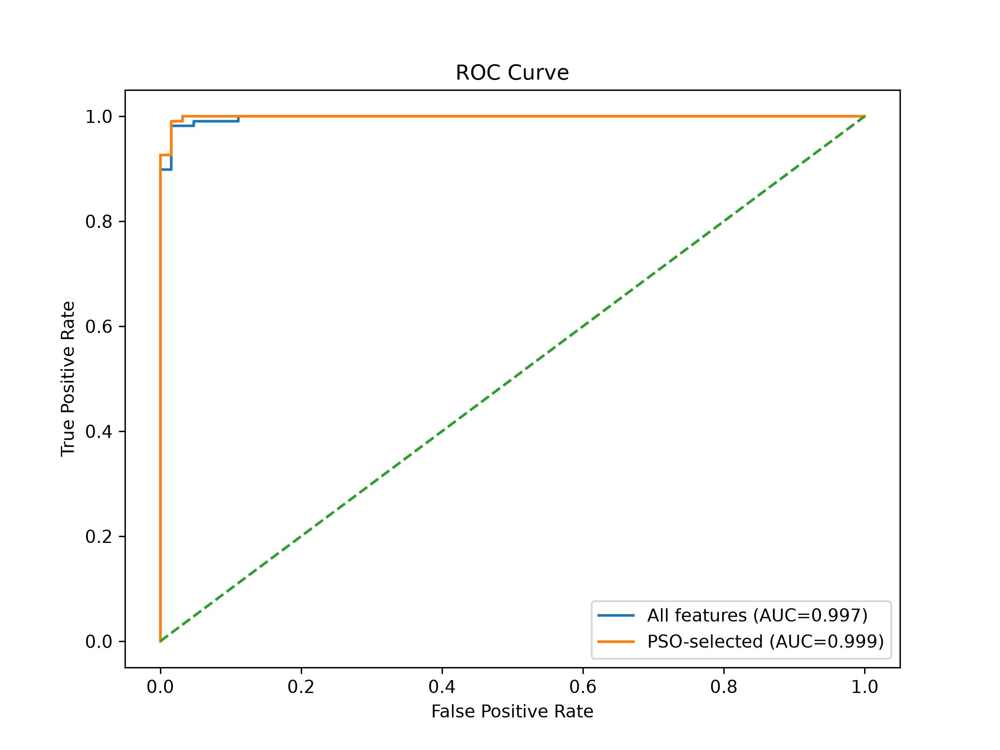
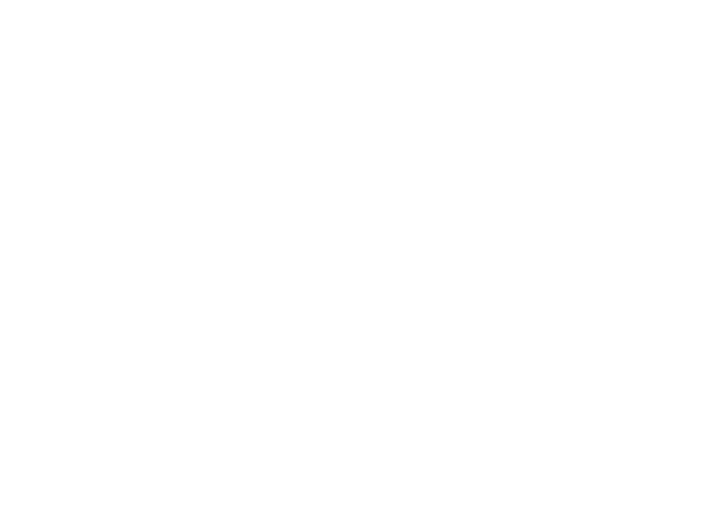
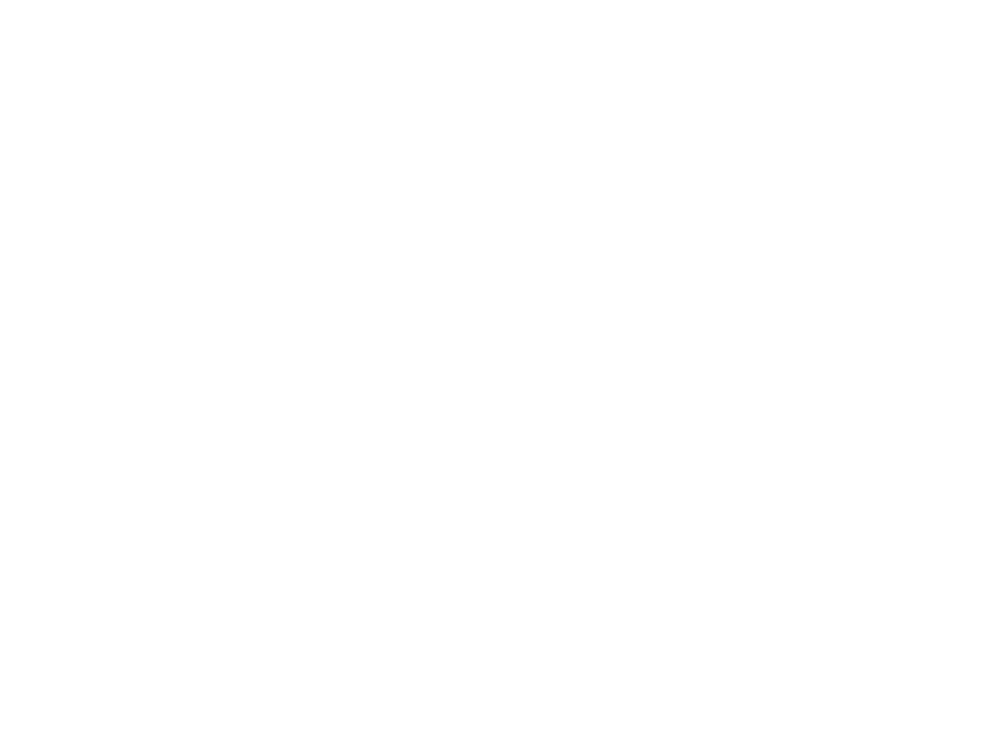

# Particle Swarm Optimization for Breast Cancer Diagnosis using Random Forest Feature Selection


---

# Project Overview

This project demonstrates the application of **Particle Swarm Optimization (PSO)** for feature selection in breast cancer diagnosis using the **Breast Cancer Wisconsin Diagnostic Dataset**. The objective is to identify the most informative medical biomarkers while maintaining high diagnostic accuracy with a Random Forest classifier.

Rather than training a model using all available features, PSO searches the feature space for an optimal subset of biomarkers that maximizes predictive performance while reducing model complexity.

The project covers the complete machine learning workflow including exploratory data analysis, preprocessing, optimization, feature selection, model training, evaluation, and visualization.

---

# Objectives

- Explore the Breast Cancer Wisconsin Dataset
- Perform comprehensive exploratory data analysis
- Standardize numerical features
- Apply Particle Swarm Optimization for feature selection
- Train Random Forest classifiers
- Compare baseline and optimized models
- Evaluate classification performance
- Visualize optimization and diagnostic results

---

# Workflow

```
Dataset
      │
      ▼
Exploratory Data Analysis
      │
      ▼
Data Preprocessing
      │
      ▼
Feature Standardization
      │
      ▼
Particle Swarm Optimization
      │
      ▼
Optimal Feature Selection
      │
      ▼
Random Forest Classification
      │
      ▼
Performance Evaluation
      │
      ▼
Visualization
```

---

# Dataset

The project uses the **Breast Cancer Wisconsin Diagnostic Dataset**.

Dataset Characteristics

- Samples: **569**
- Features: **30 numerical biomarkers**
- Classes:
  - Malignant
  - Benign

The dataset is publicly available through Scikit-learn.

---

# Exploratory Data Analysis

## Class Distribution



The class distribution demonstrates a reasonably balanced dataset suitable for supervised binary classification.

---

## Feature Correlation Matrix



Correlation analysis reveals highly correlated biomarkers, motivating feature selection to remove redundancy.

---

## Principal Component Analysis (PCA)



PCA provides a two-dimensional representation of the dataset, illustrating the separation between malignant and benign samples.

---

# Particle Swarm Optimization

Particle Swarm Optimization searches for the subset of biomarkers that minimizes classification error.

Each particle represents a candidate feature subset.

Fitness Function

```
Fitness = 1 − Classification Accuracy
```

Optimization Parameters

- Swarm Size: 30 particles
- Iterations: 30
- Inertia Weight: 0.7
- Cognitive Coefficient: 1.5
- Social Coefficient: 1.5

---

## Feature Selection Mask



The optimization process automatically selects informative biomarkers while removing redundant variables.

---

## Feature Importance



Random Forest feature importance highlights the biomarkers that contribute most significantly to breast cancer diagnosis.

---

## Biomarker Distribution


Boxplots illustrate the distribution of the most influential biomarkers across malignant and benign classes.

---

# Model Performance

## Accuracy Comparison



Comparison between the baseline model (all features) and the PSO-selected feature subset.

---

## Confusion Matrix



The confusion matrix summarizes prediction performance across both diagnostic classes.

---

## ROC Curve



The Receiver Operating Characteristic curve demonstrates the model's ability to distinguish malignant from benign tumors.

---

## Precision–Recall Curve



Precision–Recall analysis provides additional insight into classification performance, particularly for medical diagnosis.

---

## Learning Curve



The learning curve evaluates model generalization as the number of training samples increases.

---

# Results

The project successfully demonstrates that Particle Swarm Optimization can reduce feature dimensionality while maintaining excellent diagnostic performance.

The notebook produces:

- Exploratory Data Analysis
- Correlation Analysis
- PCA Visualization
- Particle Swarm Optimization
- Feature Selection
- Random Forest Classification
- Feature Importance Analysis
- Accuracy Comparison
- Confusion Matrix
- ROC Curve
- Precision–Recall Curve
- Learning Curve

---

# Technologies Used

- Python
- NumPy
- Pandas
- Matplotlib
- Scikit-learn
- SciPy
- PySwarms
- Random Forest

---

# Installation

Clone the repository

```bash
git clone https://github.com/<your-username>/05_Particle_Swarm_Optimization.git
```

Move into the project directory

```bash
cd 05_Particle_Swarm_Optimization
```

Install the required packages

```bash
pip install -r requirements.txt
```

---

# Running the Project

Launch Jupyter Notebook

```bash
jupyter notebook
```

Open

```
Particle_Swarm_Optimization.ipynb
```

Run every notebook cell sequentially.

---

# Requirements

- Python 3.10+
- NumPy
- Pandas
- Matplotlib
- Scikit-learn
- SciPy
- PySwarms
- Jupyter Notebook

---

# Outputs

Running the notebook automatically generates:

- Class Distribution
- Correlation Matrix
- PCA Projection
- Feature Selection Mask
- Feature Importance
- Biomarker Boxplots
- Accuracy Comparison
- Confusion Matrix
- ROC Curve
- Precision–Recall Curve
- Learning Curve

All figures are saved inside the **images/** directory.

---

# Repository Structure

```
05_Particle_Swarm_Optimization/

├── Particle_Swarm_Optimization.ipynb
├── README.md
├── requirements.txt
├── LICENSE
│
├── docs/
│   └── README.md
│
├── dataset/
│   └── README.md
│
└── images/
    ├── cover.png
    ├── class_distribution.png
    ├── correlation_matrix.png
    ├── pca_projection.png
    ├── feature_selection_mask.png
    ├── feature_importance.png
    ├── biomarker_boxplots.png
    ├── accuracy_comparison.png
    ├── confusion_matrix.png
    ├── roc_curve.png
    ├── precision_recall_curve.png
    └── learning_curve.png
```

---

# Future Improvements

- Binary Particle Swarm Optimization
- Multi-objective Optimization
- Genetic Algorithms
- Differential Evolution
- XGBoost
- LightGBM
- CatBoost
- Bayesian Hyperparameter Optimization
- SHAP Explainability

---

# License

This project is released under the **MIT License**.

---

# Acknowledgements

- Scikit-learn Developers
- PySwarms Developers
- University of Wisconsin Breast Cancer Dataset
- Open-source Python Community

---

# Author

**Oscar Kiamba**

Artificial Intelligence • Machine Learning • Data Science